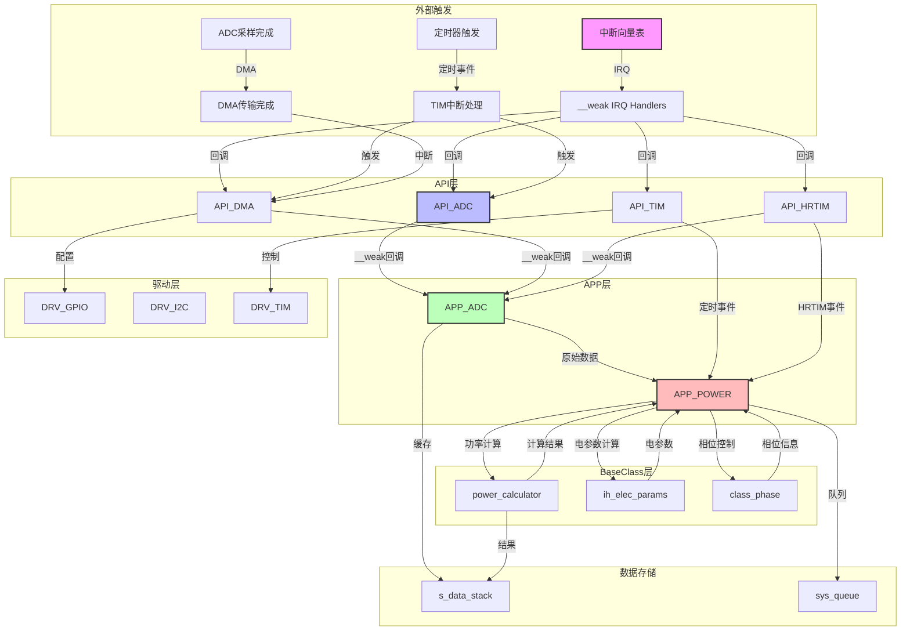

# 代码分析报告

## 一、Weak 符号清单

### 1.1 带有 Callback 后缀的 Weak 函数

| 序号 | 函数名 | 所在文件 |
|:---:|--------|----------|
| 1 | `API_ADC_Instance_RecoverCallBack` | `LIB/API/API_adc.c` |
| 2 | `API_ADC_Instance_SaveCallBack` | `LIB/API/API_adc.c` |
| 3 | `API_VcIc_EOC_IRQHandlerCallBack` | `LIB/API/API_adc.c` |
| 4 | `API_PAN_JEOC_IRQHandlerCallBack` | `LIB/API/API_adc.c` |
| 5 | `API_T34_EOC_IRQHandlerCallBack` | `LIB/API/API_adc.c` |
| 6 | `API_T12_EOC_IRQHandlerCallBack` | `LIB/API/API_adc.c` |
| 7 | `API_ADC_Current1AWD_IRQHandlerCallBack` | `LIB/API/API_adc.c` |
| 8 | `API_ADC_Current2AWD_IRQHandlerCallBack` | `LIB/API/API_adc.c` |
| 9 | `API_ADC_PanWaitEdgeCallBack` | `LIB/API/API_adc.c` |
| 10 | `API_HRTIM1_TEST_UPD_IRQHandlerCallback` | `LIB/API/API_hrtim.c` |
| 11 | `API_HRTIM1_TEST_CMP1_IRQHandlerCallback` | `LIB/API/API_hrtim.c` |
| 12 | `API_HRTIM_PanOffCallBack` | `LIB/API/API_hrtim.c` |
| 13 | `API_FB_IRQHandlerCallback` | `LIB/API/API_hrtim_fullbridge.c` |
| 14 | `API_DMA_TxA_IRQHandlerCallBack` | `API/src/API_DMA.C` |
| 15 | `API_DMA_PAN_IRQHandlerCallBack` | `API/src/API_DMA.C` |
| 16 | `API_DMA_T1A_IRQHandlerCallBack` | `API/src/API_DMA.C` |
| 17 | `API_ADC_DMA_M2M_IRQHandlerCallBack` | `API/src/API_DMA.C` |
| 18 | `API_DMA_M2M_OverCallback` | `API/src/API_DMA.C` |
| 19 | `API_FB_IRQHandler_Callback` | `LIB/API/API_hrtim_fullbridge1.c` |
| 20 | `API_FMAC_AppAdcOverCallBack` | `LIB/API/API_FMAC.C` |
| 21 | `API_FMAC_AppPowerOverCallBack` | `LIB/API/API_FMAC.C` |
| 22 | `API_UART_RxEventCallback` | `API/src/API_UART.C` |

### 1.2 不带 Callback 后缀的 Weak 函数

| 序号 | 函数名 | 所在文件 | 说明 |
|:---:|--------|----------|------|
| 1 | `Error_Handler` | `LIB/API/API_adc.c` | 通用错误处理 |
| 2 | `Error_Handler` | `LIB/API/API_hrtim.c` | 通用错误处理 |
| 3 | `Error_Handler` | `LIB/API/API_hrtim_master_sync.c` | 通用错误处理 |
| 4 | `Error_Handler` | `API/src/API_TIM.C` | 通用错误处理 |
| 5 | `Error_Handler` | `API/src/API_DMA.C` | 通用错误处理 |
| 6 | `Error_Handler` | `LIB/API/API_FMAC.C` | 通用错误处理 |
| 7 | `Error_Handler` | `API/src/API_I2C.C` | 通用错误处理 |
| 8 | `Error_Handler` | `LIB/API/API_OPAM.C` | 通用错误处理 |
| 9 | `Error_Handler` | `API/src/API_UART.C` | 通用错误处理 |
| 10 | `Error_Handler` | `LIB/API/API_DAC.C` | 通用错误处理 |
| 11 | `API_HRTIM1_TEST1_IRQHandler` | `Users/src/rx32g4xx_it.c` | 中断处理 |
| 12 | `API_TIM6_IRQHandler` | `Users/src/rx32g4xx_it.c` | 中断处理 |
| 13 | `API_I2C1_EV_IRQHandler` | `Users/src/rx32g4xx_it.c` | 中断处理 |
| 14 | `API_I2C1_ER_IRQHandler` | `Users/src/rx32g4xx_it.c` | 中断处理 |
| 15 | `API_ADC1_2_IRQHandler` | `Users/src/rx32g4xx_it.c` | 中断处理 |
| 16 | `API_ADC3_IRQHandler` | `Users/src/rx32g4xx_it.c` | 中断处理 |
| 17 | `API_DMA1_Channel4_IRQHandler` | `Users/src/rx32g4xx_it.c` | 中断处理 |
| 18 | `API_DMA2_Channel3_IRQHandler` | `Users/src/rx32g4xx_it.c` | 中断处理 |
| 19 | `API_DMA1_Current_IRQHandler` | `Users/src/rx32g4xx_it.c` | 中断处理 |
| 20 | `API_DMA2_PAN_IRQHandler` | `Users/src/rx32g4xx_it.c` | 中断处理 |
| 21 | `API_DMA2_Channel7_IRQHandler` | `Users/src/rx32g4xx_it.c` | 中断处理 |
| 22 | `API_HRTIM1_TEST2_IRQHandler` | `Users/src/rx32g4xx_it.c` | 中断处理 |
| 23 | `API_ADC_PENDV_IRQHandler` | `Users/src/rx32g4xx_it.c` | 中断处理 |
| 24 | `API_HRTIM1_PAN_IRQHandler` | `Users/src/rx32g4xx_it.c` | 中断处理 |
| 25 | `API_TIM5_IRQHandler` | `Users/src/rx32g4xx_it.c` | 中断处理 |
| 26 | `API_TIM7_IRQHandler` | `Users/src/rx32g4xx_it.c` | 中断处理 |
| 27 | `API_UART_IRQHandler` | `Users/src/rx32g4xx_it.c` | 中断处理 |
| 28 | `API_DMA_FmacPreload_IRQHandler` | `Users/src/rx32g4xx_it.c` | 中断处理 |
| 29 | `API_DMA_FmacWrite_IRQHandler` | `Users/src/rx32g4xx_it.c` | 中断处理 |
| 30 | `API_DMA_FmacRead_IRQHandler` | `Users/src/rx32g4xx_it.c` | 中断处理 |
| 31 | `API_FMAC_IRQHandler` | `Users/src/rx32g4xx_it.c` | 中断处理 |
| 32 | `API_UART_RxIdle_IRQHandler` | `Users/src/rx32g4xx_it.c` | 中断处理 |
| 33 | `API_UART_TxOver_IRQHandler` | `Users/src/rx32g4xx_it.c` | 中断处理 |
| 34 | `API_MCU_100US_IRQHandler` | `API/src/API_TIM.C` | 中断处理 |
| 35 | `API_TIM_PAN_IRQHandler` | `API/src/API_TIM.C` | 中断处理 |
| 36 | `API_MCU_TXA_IRQHandler` | `API/src/API_TIM.C` | 中断处理 |
| 37 | `API_I2C_GetValue` | `API/src/API_I2C.C` | 数据获取 |
| 38 | `API_I2C_SetValue` | `API/src/API_I2C.C` | 数据设置 |

---

## 二、常规入口清单

### 2.1 API_ADC 模块

| 函数名 | 功能说明 |
|--------|----------|
| `API_ADC_Init` | ADC初始化 |
| `API_ADC_SetAdcWatchIT` | 设置ADC看门狗中断 |
| `API_ADC_T34A_ENABLE_IT_EOC` | 使能ADC3 EOC中断 |
| `API_ADC_T34A_DISABLE_IT_EOC` | 禁用ADC3 EOC中断 |
| `API_ADC_T34A_GET_IT_EOC` | 获取ADC3 EOC中断状态 |
| `API_ADC_VcIc_ENABLE_IT_EOC` | 使能ADC2 EOC中断 |
| `API_ADC_VcIc_DISABLE_IT_EOC` | 禁用ADC2 EOC中断 |
| `API_ADC_T12A_ENABLE_IT_EOC` | 使能ADC1 EOC中断 |
| `API_ADC_T12A_DISABLE_IT_EOC` | 禁用ADC1 EOC中断 |
| `API_DMA_M2M_FROM_T34A` | 从ADC3读取DMA数据 |
| `API_DMA_M2M_FROM_VcIc` | 从ADC2读取DMA数据 |
| `API_ADC_SetM2Mstatus` | 设置M2M状态 |
| `API_ADC_DMA_ONOFF` | 控制ADC DMA开关 |
| `API_ADC_GetAddressDR` | 获取ADC DR寄存器地址 |
| `API_ADC_GetAddressDRx` | 获取ADC DRx寄存器地址 |
| `API_ADC_GetAddressJDRx` | 获取ADC JDRx寄存器地址 |
| `API_ADC_GetDRx` | 获取ADC DRx值 |
| `API_ADC_GetAddressInstance` | 获取ADC实例地址 |
| `API_ADC_TxaAwdValue` | 设置TXA AWD值 |
| `API_ADC_StopAllAdc` | 停止所有ADC |
| `API_ADC_StartAllAdc` | 启动所有ADC |
| `API_ADC_DMA_HrtimCount_Init` | ADC3触发HRTIM计数初始化 |
| `API_ADC_SELECT` | 选择ADC通道 |
| `portPendvSet` | 设置PendSV |
| `portPendvClear` | 清除PendSV |
| `API_ADC_Pan_ConfigChannel` | 配置PAN检测通道 |
| `API_ADC_ClearDrxValue` | 清除DRx值 |
| `API_ADC_VcIc_ENABLE` | 使能VcIc ADC |
| `API_ADC_VcIc_DISABLE` | 禁用VcIc ADC |
| `API_ADC_GetHTR` | 获取HTR值 |

### 2.2 API_TIM 模块

| 函数名 | 功能说明 |
|--------|----------|
| `API_TIM_INIT` | 定时器初始化 |
| `API_TIM_ZERO_Init` | 过零检测定时器初始化 |
| `API_TIM_100US_SET_50Hz` | 设置100us定时器为50Hz |
| `API_TIM_100US_RESET` | 重置100us定时器 |
| `API_TIM_100US_STOP` | 停止100us定时器 |
| `API_TIM_100US_Init` | 100us定时器初始化 |
| `API_TIM_PAN_RESET` | 重置PAN定时器 |
| `API_TIM_PAN_STOP` | 停止PAN定时器 |
| `API_TIM_PAN_Init` | PAN定时器初始化 |
| `API_TIM_TXA_RESET` | 重置TXA定时器 |
| `API_TIM_TXA_STOP` | 停止TXA定时器 |
| `API_TIM_TGO_PPG_SINGLE_Init` | PPG单脉冲定时器初始化 |
| `API_TIM_TGO_PPG_SINGLE_Start` | 启动PPG单脉冲 |
| `API_TIM_GCC_DELAY` | ns级延时 |
| `API_TIM_FanSetSpeed` | 设置风机转速 |
| `API_TIM_ScrSetSpeed` | 设置继电器速度 |

### 2.3 API_DMA 模块

| 函数名 | 功能说明 |
|--------|----------|
| `API_DMA_REST` | 恢复DMA数据 |
| `API_DMA_Init` | DMA初始化 |
| `API_DMA_STOP` | 停止DMA通道 |
| `API_DMA_START` | 启动DMA通道 |
| `API_DMA_RECOVER` | 恢复DMA指针 |
| `API_DMA_GetDmaCndtr` | 获取DMA当前位置 |
| `API_DMA_GetDmaCndtrAddress` | 获取DMA位置地址 |
| `API_DMA_GetDmaHandle` | 获取DMA句柄 |

### 2.4 APP_POWER 模块

| 函数名 | 功能说明 |
|--------|----------|
| `u_power_init` | 功率模块初始化 |
| `PowerControlFun` | 功率控制函数 |
| `PowerPanCheckFun` | 锅具检测函数 |
| `AdcGroupValueFun` | ADC值处理函数 |
| `power_zero_adjust` | 零点调整 |
| `TimIrqHandlePPGstepChange` | PPG步进变化处理 |
| `Tim8IrqHandlePPGstepChange` | TIM8 PPG步进变化处理 |
| `AdcIrqHandleWatchDogLock` | ADC看门狗锁定处理 |
| `AdcIrqHandlePPGstepChangeCh1` | CH1 PPG步进变化处理 |
| `AdcIrqHandlePPGstepChangeCh2` | CH2 PPG步进变化处理 |
| `TimIrqHandleBkCh1` | CH1过流BK中断处理 |
| `TimIrqHandleBkCh2` | CH2过流BK中断处理 |
| `PowerTypeFun` | 功率模式选择 |
| `powerZeroChange` | 零点开关PPG |
| `APP_POWERR_SetTxaAwdValue` | 设置TXA AWD值 |
| `API_POWER_PanFmac` | PAN ADC FIR滤波 |
| `API_POWER_PanCheckPluse` | PAN脉冲检测 |
| `APP_POWER_TxaStrart` | 启动TXA |
| `APP_POWER_TxaDmaEnd` | TXA DMA完成处理 |
| `APP_POWER_SetTxaAwdValue` | 设置TXA AWD值 |
| `APP_POWER_CompSetValue` | 设置CMP比较电平 |
| `APP_POWER_PanStartPluse` | 产生起振脉冲 |
| `APP_POWER_PpgSetMinAll` | 所有炉头设最小功率 |
| `API_POWER_ScrOutput` | 过零开通SCR |
| `APP_POWER_CycleChange` | 切换同频/倍频 |
| `APP_POWER_CycleReset` | 恢复倍频 |
| `APP_POWER_DutyLess50` | 检查频率切换 |
| `APP_POWER_PotTypeCheck` | 检查锅具类型 |
| `APP_POWER_PotCheckRest` | 重新炉头检查 |
| `APP_POWER_GetPanDmaBuffAddress` | 获取PAN DMA缓存地址 |
| `APP_POWER_GetPanFmacBuffAddress` | 获取PAN FMAC缓存地址 |

---

## 三、死函数清单

| 函数名 | 判定原因 |
|--------|----------|
| `API_ADC_Instance_RecoverCallBack` | 仅以__weak形式声明，无H头文件暴露，需确认是否有STRONG实现 |
| `API_ADC_Instance_SaveCallBack` | 仅以__weak形式声明，无H头文件暴露，需确认是否有STRONG实现 |
| `API_I2C_GetValue` | 仅以__weak形式声明，无H头文件暴露 |
| `API_I2C_SetValue` | 仅以__weak形式声明，无H头文件暴露 |

> **说明**：精确的死函数判定需要完整的编译链接信息和静态分析工具支持。以上为基于现有信息的初步判定，实际项目中建议使用编译器警告或静态分析工具进行确认。

---

## 四、数据流向图

### 4.1 整体架构层次

```
┌─────────────────────────────────────────────────────────────────┐
│                    外部触发层 (External)                        │
│  ┌─────────────┐  ┌─────────────┐  ┌─────────────────────┐    │
│  │  中断向量表  │  │  定时器触发  │  │     DMA传输完成     │    │
│  └──────┬──────┘  └──────┬──────┘  └──────────┬──────────┘    │
└─────────│────────────────│─────────────────────│───────────────┘
          │                │                     │
          ▼                ▼                     ▼
┌─────────────────────────────────────────────────────────────────┐
│                     API 层 (Interface)                          │
│  ┌─────────────┐  ┌─────────────┐  ┌─────────────┐            │
│  │   API_ADC   │  │   API_TIM   │  │   API_DMA   │            │
│  │  (ADC控制)  │  │ (定时器控制) │  │  (DMA控制)  │            │
│  └──────┬──────┘  └──────┬──────┘  └──────┬──────┘            │
│         │                │                │                     │
│  ┌──────┴──────┐  ┌──────┴──────┐  ┌──────┴──────┐            │
│  │ API_HRTIM   │  │ API_FMAC    │  │  API_I2C    │            │
│  │ (定时器高级) │  │  (滤波加速)  │  │  (I2C通信)  │            │
│  └──────┬──────┘  └──────┬──────┘  └──────┬──────┘            │
└─────────│────────────────│────────────────│─────────────────────┘
          │                │                │
          ▼                ▼                ▼
┌─────────────────────────────────────────────────────────────────┐
│                     APP 层 (Application)                        │
│  ┌─────────────────────────────────────────────────────────┐    │
│  │                    APP_ADC                               │    │
│  │  ┌──────────┐  ┌──────────┐  ┌──────────┐               │    │
│  │  │ ADC采样  │→│ DMA处理  │→│ 数据滤波  │               │    │
│  │  └──────────┘  └──────────┘  └────┬─────┘               │    │
│  └───────────────────────────────────│─────────────────────┘    │
│                                      │                          │
│  ┌───────────────────────────────────▼─────────────────────┐    │
│  │                    APP_POWER                             │    │
│  │  ┌──────────┐  ┌──────────┐  ┌──────────┐  ┌──────────┐│    │
│  │  │功率控制  │  │锅具检测  │  │过零处理  │  │保护逻辑  ││    │
│  │  └──────────┘  └──────────┘  └──────────┘  └──────────┘│    │
│  └─────────────────────────────────────────────────────────┘    │
└─────────────────────────────────────────────────────────────────┘
                                      │
          ┌───────────────────────────┼───────────────────────────┐
          ▼                           ▼                           ▼
┌─────────────────────┐  ┌─────────────────────┐  ┌─────────────────────┐
│    BaseClass 层     │  │      DRV 层         │  │     数据存储层      │
│ ┌─────────────────┐ │  │ ┌─────────────────┐ │  │ ┌─────────────────┐ │
│ │ power_calculator│ │  │ │   DRV_GPIO      │ │  │ │ s_data_stack    │ │
│ │ ih_elec_params  │ │  │ │   DRV_I2C       │ │  │ │   sys_queue     │ │
│ │   class_phase   │ │  │ │   DRV_TIM       │ │  │ │                 │ │
│ └─────────────────┘ │  │ └─────────────────┘ │  │ └─────────────────┘ │
└─────────────────────┘  └─────────────────────┘  └─────────────────────┘
```

### 4.2 核心数据流向



### 4.3 __weak 回调路由机制

| 回调类型 | 定义位置 | 实现位置 | 数据流向 |
|----------|----------|----------|----------|
| ADC相关 | `LIB/API/API_adc.c` | `LIB/APP/APP_ADC.C` | API → APP |
| DMA相关 | `API/src/API_DMA.C` | `LIB/APP/APP_ADC.C` | API → APP |
| HRTIM相关 | `LIB/API/API_hrtim.c` | `APP/POWER/src/...` | API → APP |
| FMAC相关 | `LIB/API/API_FMAC.C` | `APP/POWER/src/...` | API → APP |
| I2C相关 | `API/src/API_I2C.C` | `INTERFACE/src/...` | API → INTERFACE |

---

## 五、分析总结

### 5.1 Weak 符号统计

| 类别 | 数量 | 占比 |
|------|------|------|
| 带 Callback 后缀 | 22 | 37% |
| 不带 Callback 后缀 | 38 | 63% |
| **总计** | **60** | **100%** |

### 5.2 架构特点

1. **弱耦合设计**：通过 `__weak` 机制实现模块间的解耦，API层提供桩函数，APP层提供具体实现
2. **中断驱动**：系统采用中断驱动架构，通过弱符号IRQ Handler实现中断处理的可扩展性
3. **分层架构**：清晰的四层架构（API → APP → BaseClass → DRV）
4. **数据流向清晰**：ADC采样 → DMA传输 → APP处理 → 控制输出

### 5.3 潜在优化点

1. **死函数清理**：建议通过静态分析工具确认并清理未使用的函数
2. **命名规范**：部分 `__weak` 函数未遵循 Callback 后缀命名规范，建议统一
3. **Error_Handler 重复定义**：多个文件定义了相同的 `Error_Handler`，建议统一实现

---

**生成时间**：2026-06-08  
**项目路径**：`D:\OBSIDIAN\MOVING IH\低耦合程序架构\m4_ekf_observer\src\RX32G410_FW_HAL_V1.3N\Projects`