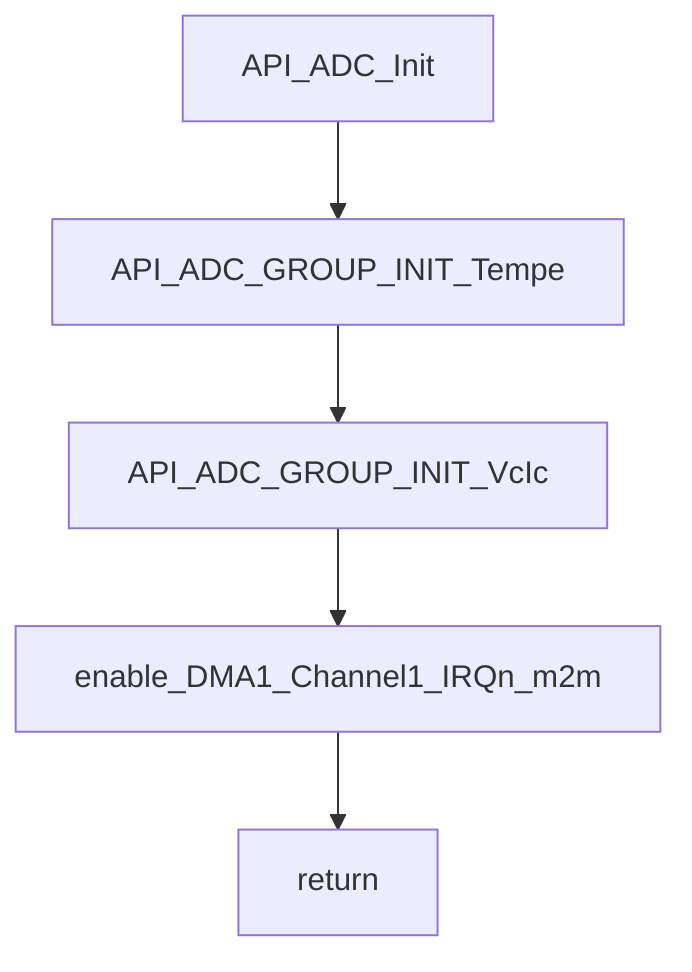
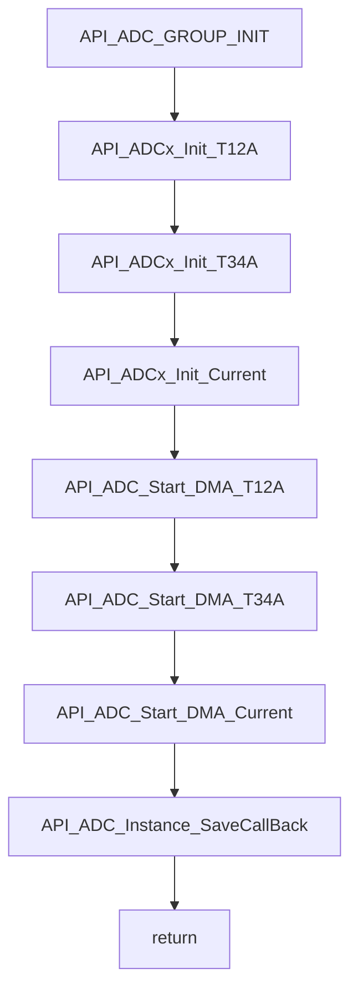
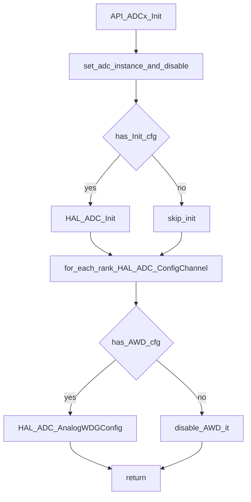
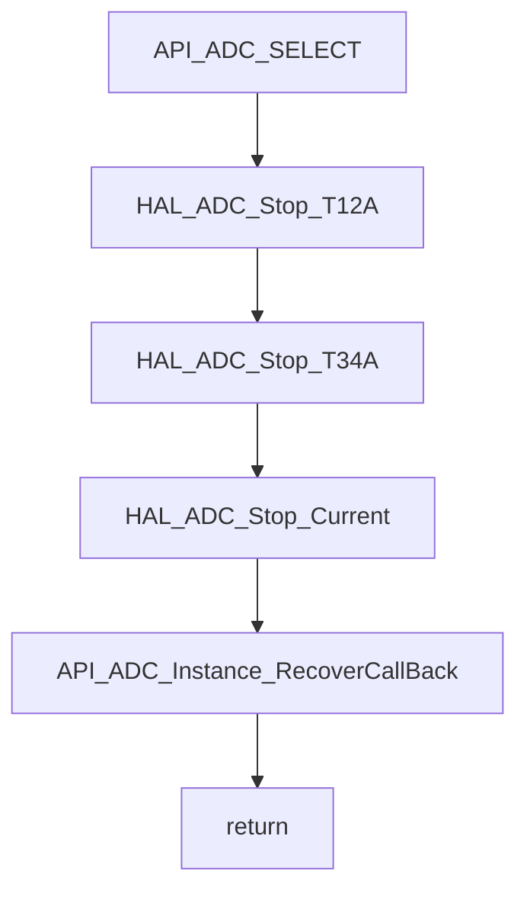
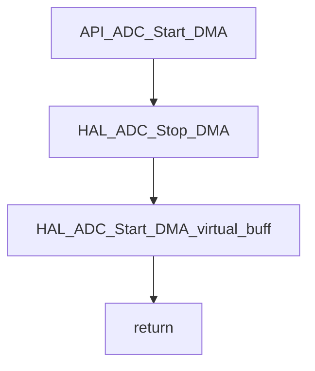
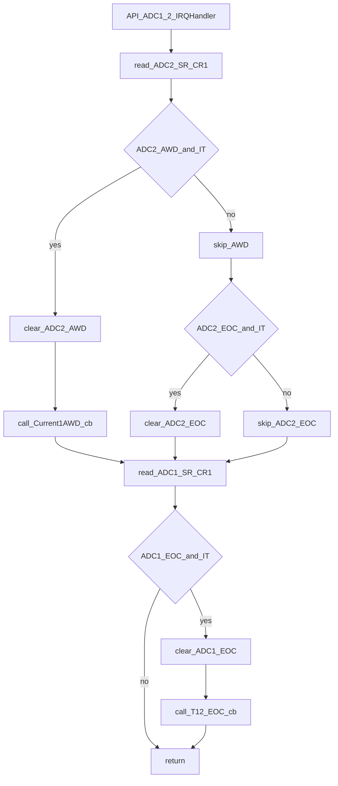
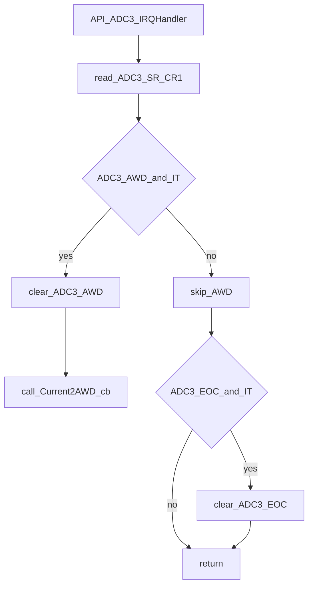
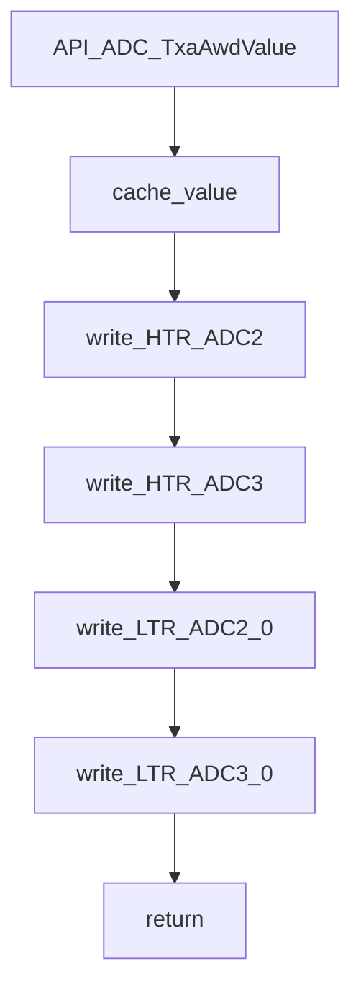
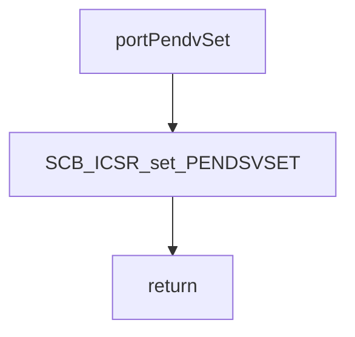
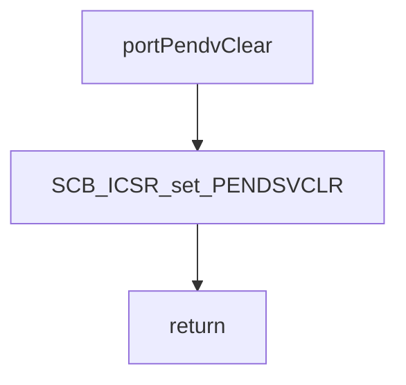

# API/API_adc.c 流程分解

目标：只基于 [API_adc.c](file:///D:/OBSIDIAN/MOVING%20IH/%E4%BD%8E%E8%80%A6%E5%90%88%E7%A8%8B%E5%BA%8F%E6%9E%B6%E6%9E%84/m4_ekf_observer/src/RX32G410_FW_HAL_V1.3N/Projects/LIB/API/API_adc.c)（必要时参考接口头 [API_adc.h](file:///D:/OBSIDIAN/MOVING%20IH/%E4%BD%8E%E8%80%A6%E5%90%88%E7%A8%8B%E5%BA%8F%E6%9E%B6%E6%9E%84/m4_ekf_observer/src/RX32G410_FW_HAL_V1.3N/Projects/API/inc/API_adc.h)）生成“初始化 → 分组切换 → DMA/M2M 数据面 → 中断回调”的流程图与功能流转说明。

## 外部依赖（按名称标注）

- `rx32g4xx_hal.h` / `system_init.h` / `system_bsp.h`：HAL 与系统资源
- `API_gpio.h`：调试 IO / 外部同步引脚（按名称理解）
- `HAL_ADC_*` / `HAL_DMA_*` / `__HAL_ADC_*`：ADC/DMA 底层驱动
- `DMA1_Channel1_IRQn`：该文件启用 M2M DMA IRQ（中断处理函数通常在别处）

## 入口分类（按“初始化/中断/运行期控制”）

- 初始化入口：
  - `API_ADC_Init()`
- 中断入口（事件驱动）：
  - `API_ADC1_2_IRQHandler()`：ADC2(过流 AWD) + ADC1(EOC)
  - `API_ADC3_IRQHandler()`：ADC3(过流 AWD) + ADC3(EOC)
- 运行期控制接口（被业务层调用）：
  - 分组初始化/切换：`API_ADC_GROUP_INIT()` / `API_ADC_SELECT()`
  - 启停：`API_ADC_StopAllAdc()` / `API_ADC_StartAllAdc()`
  - EOC 中断开关：`API_ADC_T12A_ENABLE_IT_EOC()` / `API_ADC_T12A_DISABLE_IT_EOC()` / `API_ADC_T34A_ENABLE_IT_EOC()` / `API_ADC_T34A_DISABLE_IT_EOC()`
  - AWD 门控：`API_ADC_SetAdcWatchIT()`
  - PendSV：`portPendvSet()` / `portPendvClear()`
  - 寄存器地址获取：`API_ADC_GetAddressDR()` / `API_ADC_GetAddressDRx()` / `API_ADC_GetAddressJDRx()` / `API_ADC_GetDRx()` / `API_ADC_GetAddressInstance()`
  - 过流阈值：`API_ADC_TxaAwdValue()`（强符号实现，带缓存）

## 弱符号回调（由业务层强实现）

- `API_ADC_Instance_SaveCallBack(ch)` / `API_ADC_Instance_RecoverCallBack(ch)`：由 APP_ADC 提供强实现，用于保存/恢复 ADC Instance（用于分组切换或 M2M）
- `API_T12_EOC_IRQHandlerCallBack()`：ADC1 EOC 回调（APP_ADC 中实现）
- `API_ADC_Current1AWD_IRQHandlerCallBack()`：ADC2 AWD（过流）回调（APP_POWER 中实现）
- `API_ADC_Current2AWD_IRQHandlerCallBack()`：ADC3 AWD（过流）回调（APP_POWER 中实现）

---

## 初始化：API_ADC_Init → API_ADC_GROUP_INIT(TEMPE) + API_ADC_GROUP_INIT(VCIC)

代码位置：

- `API_ADC_Init()`：[API_adc.c:L1431-L1452](file:///D:/OBSIDIAN/MOVING%20IH/%E4%BD%8E%E8%80%A6%E5%90%88%E7%A8%8B%E5%BA%8F%E6%9E%B6%E6%9E%84/m4_ekf_observer/src/RX32G410_FW_HAL_V1.3N/Projects/LIB/API/API_adc.c#L1431-L1452)
- `API_ADC_GROUP_INIT()`：[API_adc.c:L1354-L1376](file:///D:/OBSIDIAN/MOVING%20IH/%E4%BD%8E%E8%80%A6%E5%90%88%E7%A8%8B%E5%BA%8F%E6%9E%B6%E6%9E%84/m4_ekf_observer/src/RX32G410_FW_HAL_V1.3N/Projects/LIB/API/API_adc.c#L1354-L1376)

关键意图（按代码行为）：

- `API_ADC_Init()` 在启动时把两套“采样组”都初始化一次：
  - `ADC_Select_Tempe`：温度/过零相关组（按注释理解）
  - `ADC_Select_VcIc`：正常加热采样组（按注释理解）
- `API_ADC_GROUP_INIT(group)` 实际执行：
  - 3 路 ADC 的通道/看门狗配置：`API_ADCx_Init()`
  - 3 路 ADC 的 DMA 使能：`API_ADC_Start_DMA()`
  - 交给业务层保存 instance：`API_ADC_Instance_SaveCallBack(group)`

流程图（初始化主线）：

### ADC 单路配置：API_ADCx_Init（通道表 + AWD 绑定）

代码位置：[API_adc.c:L1265-L1324](file:///D:/OBSIDIAN/MOVING%20IH/%E4%BD%8E%E8%80%A6%E5%90%88%E7%A8%8B%E5%BA%8F%E6%9E%B6%E6%9E%84/m4_ekf_observer/src/RX32G410_FW_HAL_V1.3N/Projects/LIB/API/API_adc.c#L1265-L1324)

---

## 分组切换：API_ADC_SELECT（停止 ADC → RecoverCallBack）

代码位置：[API_adc.c:L1417-L1430](file:///D:/OBSIDIAN/MOVING%20IH/%E4%BD%8E%E8%80%A6%E5%90%88%E7%A8%8B%E5%BA%8F%E6%9E%B6%E6%9E%84/m4_ekf_observer/src/RX32G410_FW_HAL_V1.3N/Projects/LIB/API/API_adc.c#L1417-L1430)

关键效果：

- 先 stop 三路 ADC（T12A/T34A/Current）
- 调用 `API_ADC_Instance_RecoverCallBack(group)`，由 APP_ADC 决定如何把某个 group 的 instance 配置恢复到硬件

---

## DMA 触发启动：API_ADC_Start_DMA（打开 DMAEN 并启动虚拟 DMA）

代码位置：[API_adc.c:L1476-L1484](file:///D:/OBSIDIAN/MOVING%20IH/%E4%BD%8E%E8%80%A6%E5%90%88%E7%A8%8B%E5%BA%8F%E6%9E%B6%E6%9E%84/m4_ekf_observer/src/RX32G410_FW_HAL_V1.3N/Projects/LIB/API/API_adc.c#L1476-L1484)

关键点（按注释）：

- `HAL_ADC_Start_DMA(hadc, AdcBuff, 8)` 的 DMA 目标地址是“虚拟占位”，实际 DMA 目的地址通常在外部的 recover/M2M 逻辑中被改写

---

## 中断：ADC1_2 与 ADC3（AWD 过流 + EOC）

### ADC1_2：API_ADC1_2_IRQHandler

代码位置：[API_adc.c:L1490-L1542](file:///D:/OBSIDIAN/MOVING%20IH/%E4%BD%8E%E8%80%A6%E5%90%88%E7%A8%8B%E5%BA%8F%E6%9E%B6%E6%9E%84/m4_ekf_observer/src/RX32G410_FW_HAL_V1.3N/Projects/LIB/API/API_adc.c#L1490-L1542)

关键分支：

- ADC2 AWD：清标志 → `API_ADC_Current1AWD_IRQHandlerCallBack()`
- ADC1 EOC：清标志 → `API_T12_EOC_IRQHandlerCallBack()`
- ADC2 EOC：当前仅清标志（注释为“VCIC 累加”，实际处理可能在别处）

### ADC3：API_ADC3_IRQHandler

代码位置：[API_adc.c:L1543-L1567](file:///D:/OBSIDIAN/MOVING%20IH/%E4%BD%8E%E8%80%A6%E5%90%88%E7%A8%8B%E5%BA%8F%E6%9E%B6%E6%9E%84/m4_ekf_observer/src/RX32G410_FW_HAL_V1.3N/Projects/LIB/API/API_adc.c#L1543-L1567)

---

## 过流阈值：API_ADC_TxaAwdValue（带缓存，解决通道切换寄存器重置）

代码位置：[API_adc.c:L1691-L1700](file:///D:/OBSIDIAN/MOVING%20IH/%E4%BD%8E%E8%80%A6%E5%90%88%E7%A8%8B%E5%BA%8F%E6%9E%B6%E6%9E%84/m4_ekf_observer/src/RX32G410_FW_HAL_V1.3N/Projects/LIB/API/API_adc.c#L1691-L1700)

关键意图（按代码注释）：

- ADC 通道切换后硬件 AWD 寄存器可能被重置，因此需要把“上次设置值”缓存并重写到 `HTR/LTR`

---

## PendSV 门控：portPendvSet / portPendvClear

代码位置：[API_adc.c:L1631-L1638](file:///D:/OBSIDIAN/MOVING%20IH/%E4%BD%8E%E8%80%A6%E5%90%88%E7%A8%8B%E5%BA%8F%E6%9E%B6%E6%9E%84/m4_ekf_observer/src/RX32G410_FW_HAL_V1.3N/Projects/LIB/API/API_adc.c#L1631-L1638)

