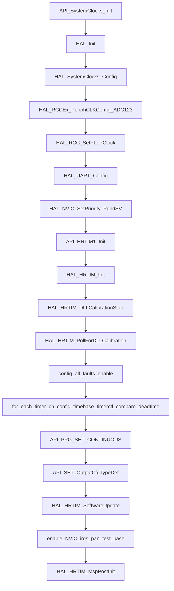
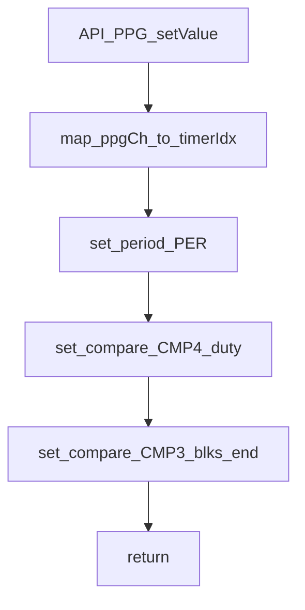
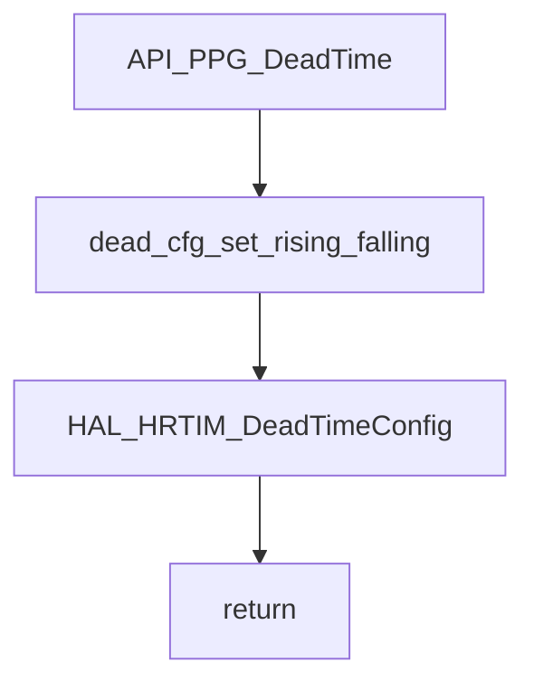
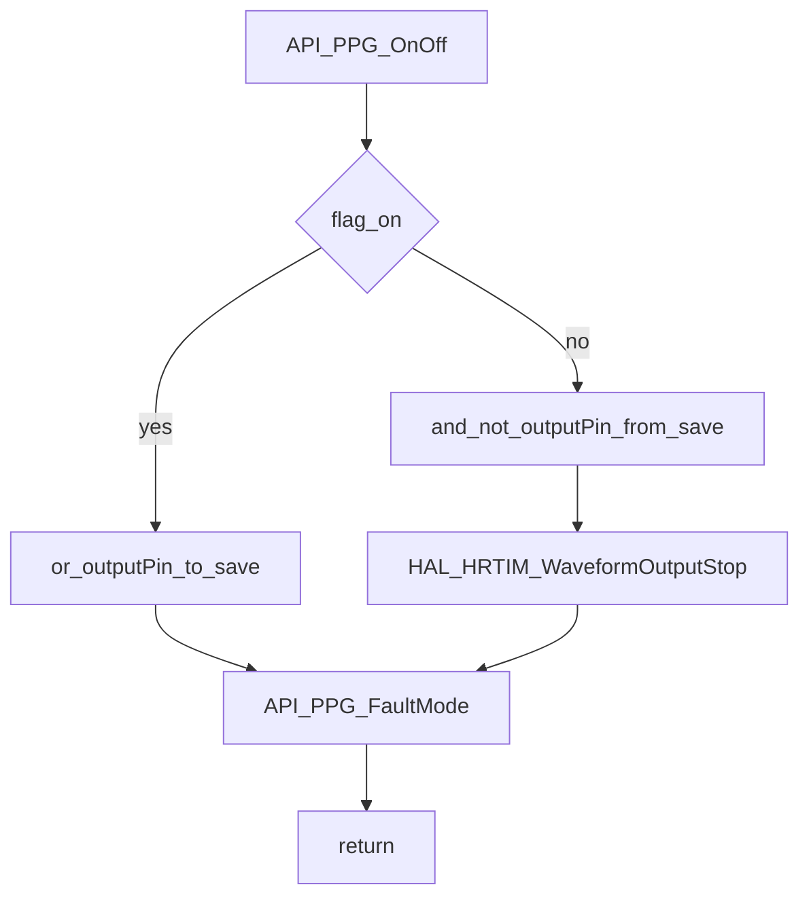
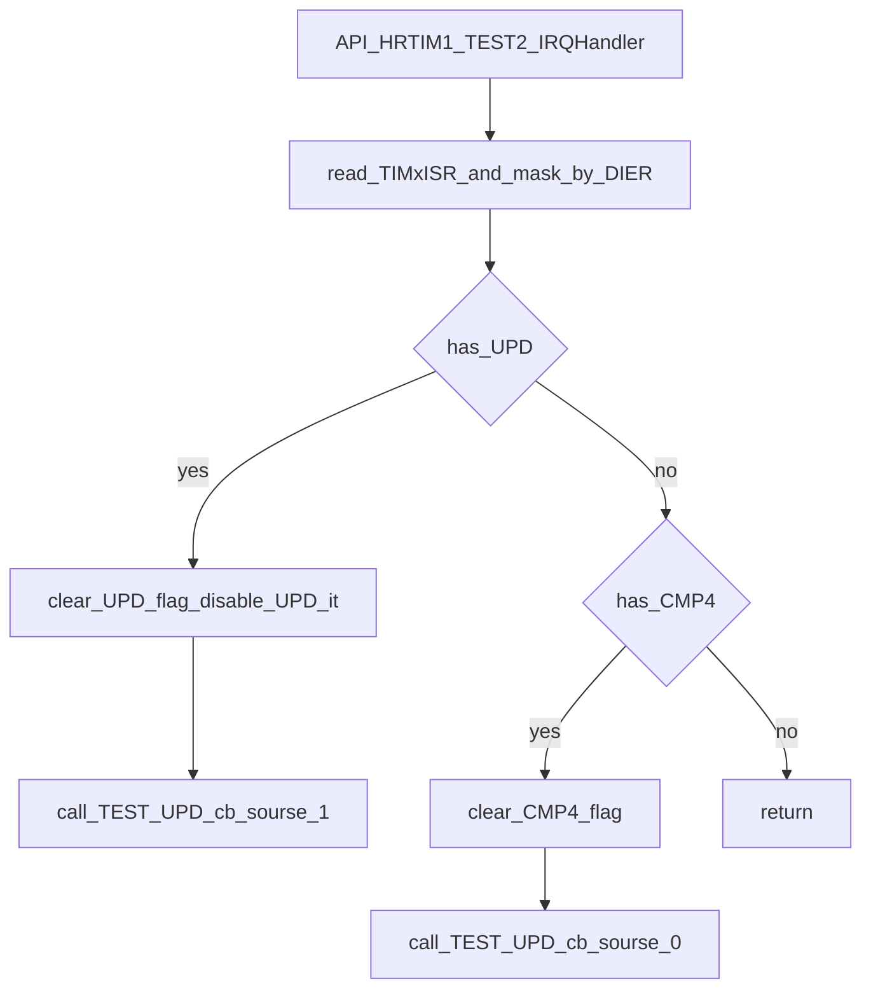
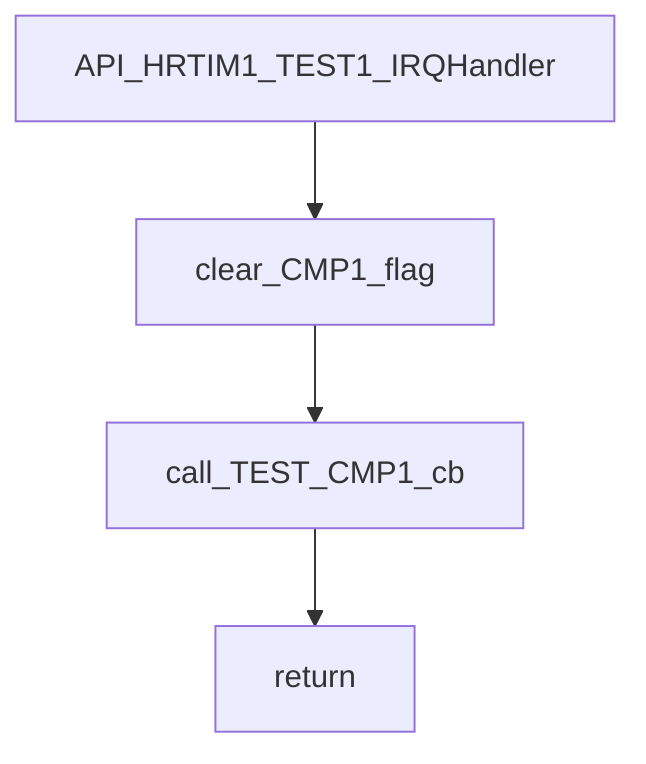
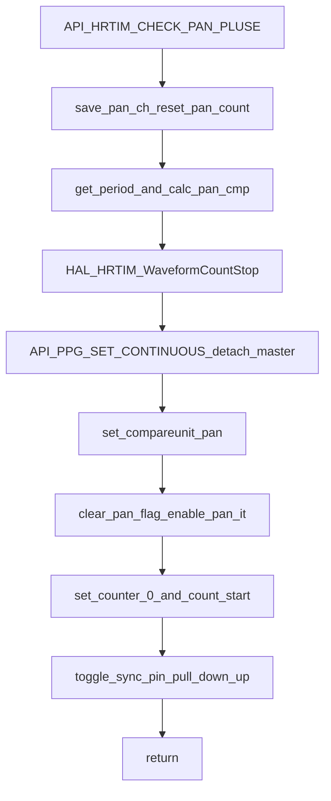
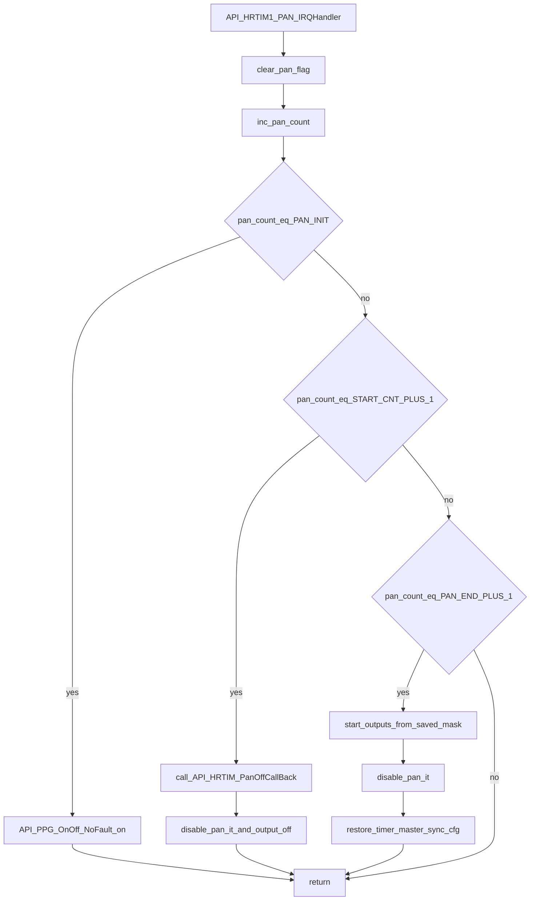
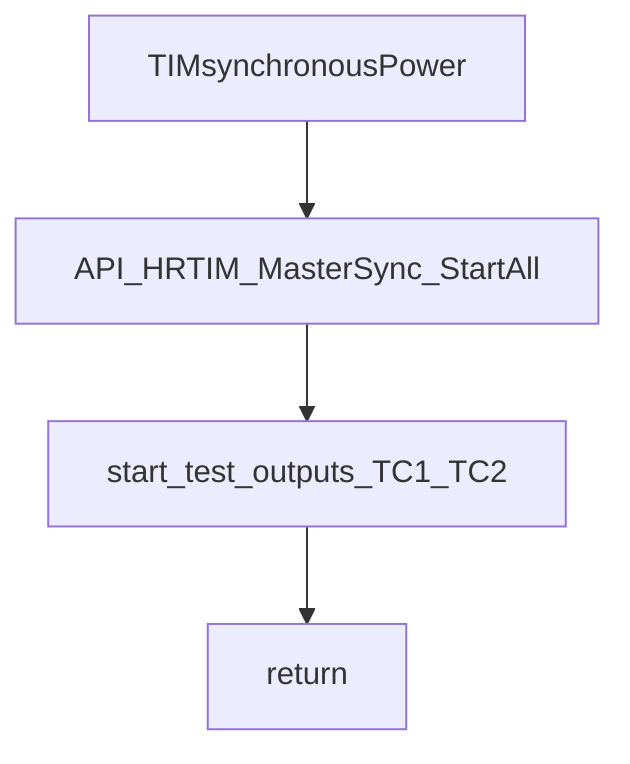
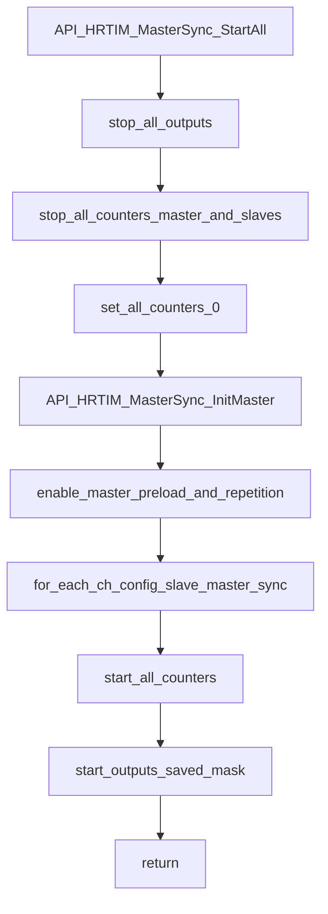

# API/API_hrtim.c 流程分解

目标：只基于 [API_hrtim.c](file:///D:/OBSIDIAN/MOVING%20IH/%E4%BD%8E%E8%80%A6%E5%90%88%E7%A8%8B%E5%BA%8F%E6%9E%B6%E6%9E%84/m4_ekf_observer/src/RX32G410_FW_HAL_V1.3N/Projects/LIB/API/API_hrtim.c)（必要时参考接口头 [API_HRTIM.h](file:///D:/OBSIDIAN/MOVING%20IH/%E4%BD%8E%E8%80%A6%E5%90%88%E7%A8%8B%E5%BA%8F%E6%9E%B6%E6%9E%84/m4_ekf_observer/src/RX32G410_FW_HAL_V1.3N/Projects/API/inc/API_HRTIM.h)）生成“初始化 → 中断/回调 → PPG 输出控制 → 检锅/同步”的流程图与功能流转说明。

## 外部依赖（按名称标注）

- `rx32g4xx_hal.h` / `system_init.h` / `system_bsp.h`：HAL 与系统初始化
- `API_tim.h` / `API_adc.h`：与 TIM/ADC 协同的触发/回调（按名称理解）
- `API_gpio.h` / `DRV_GPIO.H`：同步引脚拉高/拉低、IO 控制（按名称理解）
- HRTIM HAL：`HAL_HRTIM_*` / `__HAL_HRTIM_*`（寄存器配置与启动/停止）

## 入口分类（按“初始化/中断回调/控制接口”）

- 初始化入口：
  - `API_SystemClocks_Init()`
  - `API_HRTIM1_Init()`
- 中断/回调入口（事件驱动）：
  - `API_HRTIM1_TEST2_IRQHandler()`：Base 通道 UPD/CMP4 事件 → `API_HRTIM1_TEST_UPD_IRQHandlerCallback(sourse)`
  - `API_HRTIM1_TEST1_IRQHandler()`：Test1 CMP1 事件 → `API_HRTIM1_TEST_CMP1_IRQHandlerCallback()`
  - `API_HRTIM1_PAN_IRQHandler(ch)`：检锅脉冲流程推进 → `API_HRTIM_PanOffCallBack()`
- 运行期控制接口（供业务层调用）：
  - PPG 参数配置：`API_PPG_setValue()` / `API_PPG_setValueChx()` / `API_PPG_DeadTime()` / `API_PPG_SET_CONTINUOUS()`
  - PPG 输出开关：`API_PPG_OnOff()` / `API_PPG_OnOff_NoFault()`
  - 检锅脉冲：`API_HRTIM_CHECK_PAN_PLUSE()`
  - 同步：`TIMsynchronousPower()` / `API_HRTIM_MasterSync_*()`
  - 中断使能门控：`API_HRTIM_BASE_ENABLE_IT_CMP()` / `API_HRTIM_BASE_ENABLE_IT_UPD()` / `API_HRTIM_ENABLE_IT_REST()` 等

---

## 初始化：API_SystemClocks_Init → API_HRTIM1_Init

代码位置：

- `API_SystemClocks_Init()`：[API_hrtim.c:L713](file:///D:/OBSIDIAN/MOVING%20IH/%E4%BD%8E%E8%80%A6%E5%90%88%E7%A8%8B%E5%BA%8F%E6%9E%B6%E6%9E%84/m4_ekf_observer/src/RX32G410_FW_HAL_V1.3N/Projects/LIB/API/API_hrtim.c#L713)
- `API_HRTIM1_Init()`：[API_hrtim.c:L751](file:///D:/OBSIDIAN/MOVING%20IH/%E4%BD%8E%E8%80%A6%E5%90%88%E7%A8%8B%E5%BA%8F%E6%9E%B6%E6%9E%84/m4_ekf_observer/src/RX32G410_FW_HAL_V1.3N/Projects/LIB/API/API_hrtim.c#L751)

### 关键意图

- `API_SystemClocks_Init()`：完成 HAL 初始化、系统时钟、ADC 时钟分频、UART 配置、PendSV 优先级
- `API_HRTIM1_Init()`：完成 HRTIM 初始化与 DLL 校准、FAULT 配置、各 Timer 的 TimeBase/Compare/DeadTime/Output 配置，并统一使能中断源（PAN/Test/Base 等）

### 流程图（初始化主线）

---

## PPG 输出控制（周期/占空比/死区/开关）

### 参数写入：API_PPG_setValue / API_PPG_setValueChx

代码位置：

- `API_PPG_setValue()`：[API_hrtim.c:L986-L996](file:///D:/OBSIDIAN/MOVING%20IH/%E4%BD%8E%E8%80%A6%E5%90%88%E7%A8%8B%E5%BA%8F%E6%9E%B6%E6%9E%84/m4_ekf_observer/src/RX32G410_FW_HAL_V1.3N/Projects/LIB/API/API_hrtim.c#L986-L996)
- `API_PPG_setValueChx()`：[API_hrtim.c:L1007-L1015](file:///D:/OBSIDIAN/MOVING%20IH/%E4%BD%8E%E8%80%A6%E5%90%88%E7%A8%8B%E5%BA%8F%E6%9E%B6%E6%9E%84/m4_ekf_observer/src/RX32G410_FW_HAL_V1.3N/Projects/LIB/API/API_hrtim.c#L1007-L1015)

关键效果（按代码直观理解）：

- `API_PPG_setValue()`：通过宏 `__HAL_HRTIM_SETPERIOD/SETCOMPARE` 更新 `PER` 与 `CMP4(COMPAREUNIT_REST)`，并同步更新 `CMP3(COMPAREUNIT_BLKS_END)` 用于消隐窗口（`duty + BLKS_DIV`）
- `API_PPG_setValueChx()`：直接写 `sTimerxRegs[ch].PERxR/CMP4xR/CMP3xR`（用于更快写入/或绕开宏封装）

### 死区：API_PPG_DeadTime

代码位置：[API_hrtim.c:L973-L983](file:///D:/OBSIDIAN/MOVING%20IH/%E4%BD%8E%E8%80%A6%E5%90%88%E7%A8%8B%E5%BA%8F%E6%9E%B6%E6%9E%84/m4_ekf_observer/src/RX32G410_FW_HAL_V1.3N/Projects/LIB/API/API_hrtim.c#L973-L983)

### 开关与故障：API_PPG_OnOff / API_PPG_OnOff_NoFault / API_PPG_FaultMode

代码位置：

- `API_PPG_OnOff()`：[API_hrtim.c:L1107-L1126](file:///D:/OBSIDIAN/MOVING%20IH/%E4%BD%8E%E8%80%A6%E5%90%88%E7%A8%8B%E5%BA%8F%E6%9E%B6%E6%9E%84/m4_ekf_observer/src/RX32G410_FW_HAL_V1.3N/Projects/LIB/API/API_hrtim.c#L1107-L1126)
- `API_PPG_OnOff_NoFault()`：[API_hrtim.c:L1154-L1170](file:///D:/OBSIDIAN/MOVING%20IH/%E4%BD%8E%E8%80%A6%E5%90%88%E7%A8%8B%E5%BA%8F%E6%9E%B6%E6%9E%84/m4_ekf_observer/src/RX32G410_FW_HAL_V1.3N/Projects/LIB/API/API_hrtim.c#L1154-L1170)
- `API_PPG_FaultMode()`：[API_hrtim.c:L1084-L1101](file:///D:/OBSIDIAN/MOVING%20IH/%E4%BD%8E%E8%80%A6%E5%90%88%E7%A8%8B%E5%BA%8F%E6%9E%B6%E6%9E%84/m4_ekf_observer/src/RX32G410_FW_HAL_V1.3N/Projects/LIB/API/API_hrtim.c#L1084-L1101)

关键效果：

- `API_PPG_OnOff()`：
  - 开：把该通道输出 pin OR 到 `HrtimOutPutPinSave`，并使能对应 FAULT 模式（内部调用 `API_PPG_FaultMode`）
  - 关：清 `HrtimOutPutPinSave` 中对应 pin，并调用 `HAL_HRTIM_WaveformOutputStop`
- `API_PPG_OnOff_NoFault()`：先清故障标志、关闭故障模式，然后直接 Start/Stop 输出（常用于检锅脉冲）

---

## 中断入口（HRTIM → 回调转发）

### Base 通道：API_HRTIM1_TEST2_IRQHandler（UPD/CMP4 → 回调）

代码位置：[API_hrtim.c:L1227-L1249](file:///D:/OBSIDIAN/MOVING%20IH/%E4%BD%8E%E8%80%A6%E5%90%88%E7%A8%8B%E5%BA%8F%E6%9E%B6%E6%9E%84/m4_ekf_observer/src/RX32G410_FW_HAL_V1.3N/Projects/LIB/API/API_hrtim.c#L1227-L1249)

触发回调（弱符号，业务层可覆盖强实现）：

- `API_HRTIM1_TEST_UPD_IRQHandlerCallback(1)`：UPD 分支（且会在 ISR 内禁用 UPD 中断）
- `API_HRTIM1_TEST_UPD_IRQHandlerCallback(0)`：CMP4 分支（`HRTIM1_TEST2_IT`）

### Test1：API_HRTIM1_TEST1_IRQHandler（CMP1 → 回调）

代码位置：[API_hrtim.c:L1254-L1266](file:///D:/OBSIDIAN/MOVING%20IH/%E4%BD%8E%E8%80%A6%E5%90%88%E7%A8%8B%E5%BA%8F%E6%9E%B6%E6%9E%84/m4_ekf_observer/src/RX32G410_FW_HAL_V1.3N/Projects/LIB/API/API_hrtim.c#L1254-L1266)

---

## 检锅脉冲（脱离 MASTER 同步 → 产生脉冲 → 恢复同步）

### 发起：API_HRTIM_CHECK_PAN_PLUSE（准备 PAN 中断并起振）

代码位置：[API_hrtim.c:L1718-L1742](file:///D:/OBSIDIAN/MOVING%20IH/%E4%BD%8E%E8%80%A6%E5%90%88%E7%A8%8B%E5%BA%8F%E6%9E%B6%E6%9E%84/m4_ekf_observer/src/RX32G410_FW_HAL_V1.3N/Projects/LIB/API/API_hrtim.c#L1718-L1742)

关键意图（按代码注释与行为综合）：

- 为了让检锅通道以独立频率产生检锅脉冲，需要临时把该通道恢复为独立连续模式（`API_PPG_SET_CONTINUOUS`），避免被 MASTER 同步触发更新/复位干扰
- 设置 `COMPAREUNIT_PAN` 为当前周期的 60% 位置，并使能 `HRTIM1_PAN_IT`

### 推进：API_HRTIM1_PAN_IRQHandler（PAN 中断状态推进）

代码位置：[API_hrtim.c:L1268-L1343](file:///D:/OBSIDIAN/MOVING%20IH/%E4%BD%8E%E8%80%A6%E5%90%88%E7%A8%8B%E5%BA%8F%E6%9E%B6%E6%9E%84/m4_ekf_observer/src/RX32G410_FW_HAL_V1.3N/Projects/LIB/API/API_hrtim.c#L1268-L1343)

关键行为（只按代码逻辑抽象）：

- 每次中断 `hrtimPan.count++`，按计数值进入不同分支
- 关键分支：
  - `PAN_INIT`：打开该通道输出（NoFault 模式）
  - `PAN_START_PPG_COUNT+1`：触发一次 `API_HRTIM_PanOffCallBack()` 并关掉该通道输出与 PAN 中断
  - `PAN_END+1`：恢复 `HrtimOutPutPinSave` 输出，并把该通道定时器重新配置回 MASTER 同步（UpdateTrigger=MASTER, ResetTrigger=MASTER_PER），然后关闭 PAN 中断

---

## MASTER 同步（软件重同步：Stop → counter=0 → Start）

### 入口：TIMsynchronousPower → API_HRTIM_MasterSync_StartAll

代码位置：

- `TIMsynchronousPower()`：[API_hrtim.c:L1663-L1669](file:///D:/OBSIDIAN/MOVING%20IH/%E4%BD%8E%E8%80%A6%E5%90%88%E7%A8%8B%E5%BA%8F%E6%9E%B6%E6%9E%84/m4_ekf_observer/src/RX32G410_FW_HAL_V1.3N/Projects/LIB/API/API_hrtim.c#L1663-L1669)
- `API_HRTIM_MasterSync_StartAll()`：[API_hrtim.c:L1810-L1862](file:///D:/OBSIDIAN/MOVING%20IH/%E4%BD%8E%E8%80%A6%E5%90%88%E7%A8%8B%E5%BA%8F%E6%9E%B6%E6%9E%84/m4_ekf_observer/src/RX32G410_FW_HAL_V1.3N/Projects/LIB/API/API_hrtim.c#L1810-L1862)

### 主线：API_HRTIM_MasterSync_StartAll

关键意图（按代码行为）：

- 统一停止输出与计数（MASTER + 全部 Timer）
- 计数器清零
- 初始化 MASTER 周期（`InitMaster(START_FRE_PWM*2)`）
- 逐通道调用 `API_HRTIM_MasterSync_ConfigSlave(i, START_FRE_PWM*2)` 恢复 slave 同步配置（尤其是检锅过程中被 `API_PPG_SET_CONTINUOUS` 改回 NONE 的 Update/Reset trigger）
- 统一 CountStart 与 OutputStart（输出掩码取自 `HrtimOutPutPinSave`）

