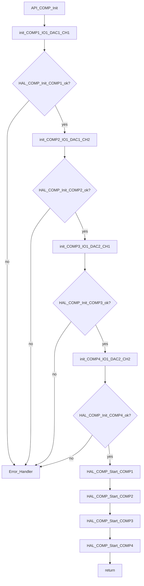
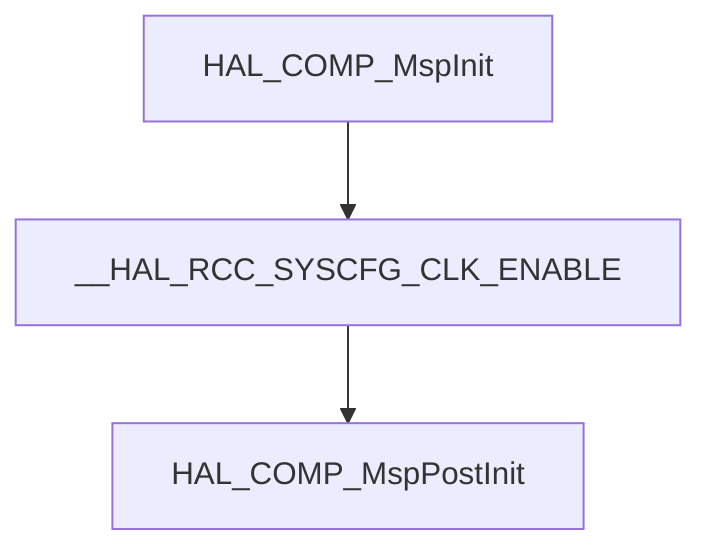

# API_comp/API_comp.c 流程分解

目标：基于 [API_comp.c](file:///D:/OBSIDIAN/MOVING%20IH/%E4%BD%8E%E8%80%A6%E5%90%88%E7%A8%8B%E5%BA%8F%E6%9E%B6%E6%9E%84/m4_ekf_observer/src/RX32G410_FW_HAL_V1.3N/Projects/LIB/API/API_comp.c) 生成流程图与功能流转说明。

## 外部依赖（按名称标注）

- `API_comp.h`：比较器 API 接口头文件
- `rx32g4xx_config_def.h` / `rx32g4xx_hal.h`：HAL 库与配置定义
- `system_init.h` / `system_bsp.h`：系统初始化与 BSP 支撑
- `HAL_COMP_Init()` / `HAL_COMP_Start()`：HAL 比较器驱动接口

## 入口分类（按“主入口/中断/独立函数”）

- 主入口（初始化入口）：`API_COMP_Init()`
- HAL MSP 回调：`HAL_COMP_MspInit()` / `HAL_COMP_MspPostInit()`
- 弱符号桩函数：`Error_Handler()`

---

## 主入口：API_COMP_Init（比较器初始化）

代码位置：[API_comp.c:L81-L149](file:///D:/OBSIDIAN/MOVING%20IH/%E4%BD%8E%E8%80%A6%E5%90%88%E7%A8%8B%E5%BA%8F%E6%9E%B6%E6%9E%84/m4_ekf_observer/src/RX32G410_FW_HAL_V1.3N/Projects/LIB/API/API_comp.c#L81-L149)

### 关键意图

- 初始化4个比较器（COMP1~COMP4），配置为同相输入接外部 IO，反相输入接 DAC 通道
- 统一配置：20mV 下降沿迟滞、0mV 上升沿迟滞、TIM1_OC5 消隐源
- 启动所有比较器

### 流程图（初始化 → 启动）

---

## HAL MSP 回调入口

### HAL_COMP_MspInit（硬件层初始化）

代码位置：[API_comp.c:L73-L78](file:///D:/OBSIDIAN/MOVING%20IH/%E4%BD%8E%E8%80%A6%E5%90%88%E7%A8%8B%E5%BA%8F%E6%9E%B6%E6%9E%84/m4_ekf_observer/src/RX32G410_FW_HAL_V1.3N/Projects/LIB/API/API_comp.c#L73-L78)

- 使能 SYSCFG 时钟：`__HAL_RCC_SYSCFG_CLK_ENABLE()`
- 调用 `HAL_COMP_MspPostInit()` 完成后续配置

### HAL_COMP_MspPostInit（GPIO 后初始化）

代码位置：[API_comp.c:L21-L71](file:///D:/OBSIDIAN/MOVING%20IH/%E4%BD%8E%E8%80%A6%E5%90%88%E7%A8%8B%E5%BA%8F%E6%9E%B6%E6%9E%84/m4_ekf_observer/src/RX32G410_FW_HAL_V1.3N/Projects/LIB/API/API_comp.c#L21-L71)

- 预留 GPIO 配置框架，当前所有 GPIO 配置均被注释
- 按 COMP1~COMP4 分支处理，预留 `DEBUG_POWER_OUT` 条件编译选项用于调试

---

## 比较器配置参数汇总

| 比较器 | 正输入 | 负输入 | 消隐源 | 下降迟滞 | 上升迟滞 |
|--------|--------|--------|--------|----------|----------|
| COMP1 | IO1 | DAC1_CH1 | TIM1_OC5 | 20mV | 0mV |
| COMP2 | IO1 | DAC1_CH2 | TIM1_OC5 | 20mV | 0mV |
| COMP3 | IO1 | DAC2_CH1 | TIM1_OC5 | 20mV | 0mV |
| COMP4 | IO1 | DAC2_CH2 | TIM1_OC5 | 20mV | 0mV |

---

## 独立函数

### Error_Handler（错误处理桩）

代码位置：[API_comp.c:L10-L13](file:///D:/OBSIDIAN/MOVING%20IH/%E4%BD%8E%E8%80%A6%E5%90%88%E7%A8%8B%E5%BA%8F%E6%9E%B6%E6%9E%84/m4_ekf_observer/src/RX32G410_FW_HAL_V1.3N/Projects/LIB/API/API_comp.c#L10-L13)

- `__attribute__((weak))` 弱符号定义，为空实现
- 供 HAL 初始化失败时调用，可被上层模块重写强实现