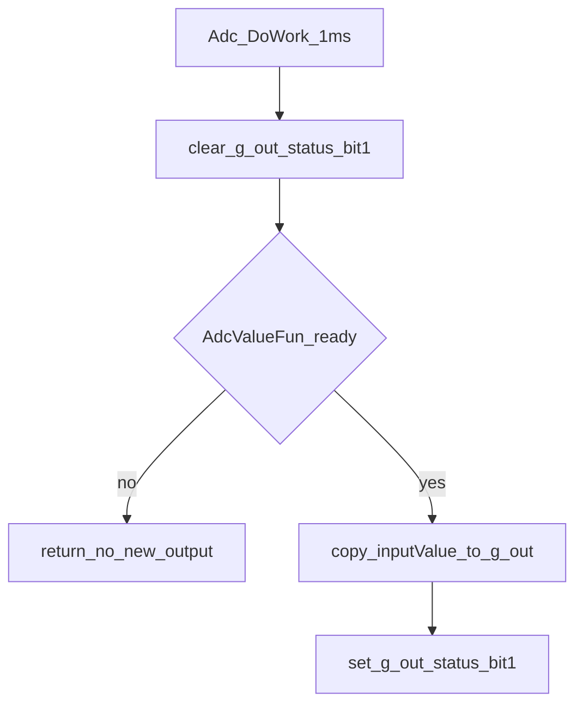
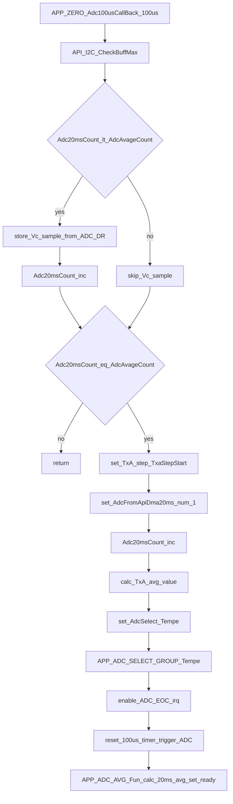
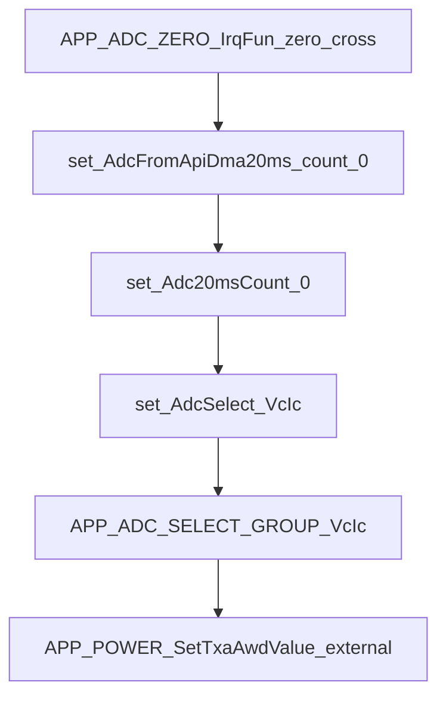
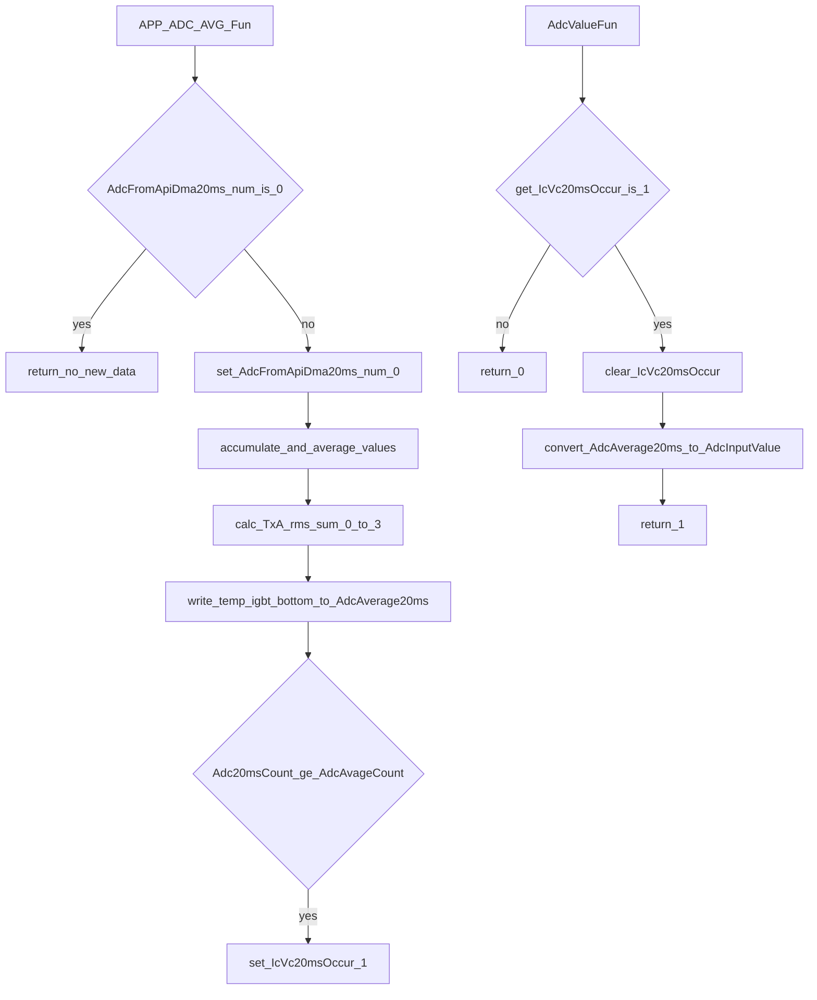

# APP_ADC/APP_ADC.C 流程分解

目标：只基于 [APP_ADC.C](file:///D:/OBSIDIAN/MOVING%20IH/%E4%BD%8E%E8%80%A6%E5%90%88%E7%A8%8B%E5%BA%8F%E6%9E%B6%E6%9E%84/m4_ekf_observer/src/RX32G410_FW_HAL_V1.3N/Projects/LIB/APP/APP_ADC.C)（必要时参考接口头 [APP_ADC.H](file:///D:/OBSIDIAN/MOVING%20IH/%E4%BD%8E%E8%80%A6%E5%90%88%E7%A8%8B%E5%BA%8F%E6%9E%B6%E6%9E%84/m4_ekf_observer/src/RX32G410_FW_HAL_V1.3N/Projects/APP/POWER/inc/APP_ADC.H)）生成“主入口（1ms）→ 中断/回调 → 独立函数”的流程图与功能流转说明。

## 外部依赖（按名称标注）

- `API_adc.h` / `API_hrtim.h` / `api_dma.h` / `API_TIM.h` / `API_gpio.h`：ADC/HRTIM/DMA/TIM/GPIO 抽象层
- `adc_processing.h`：ADC 后处理/算法支撑（按名称理解）
- `app_adc_io.h`：IO 与数据路由对接（按名称理解）
- `API_FMAC.H`：FMAC 硬件滤波（按名称理解）
- `power_calculator.h` / `wave_capture.h`：功率计算与波形捕获（按名称理解）
- `APP_POWER_SetTxaAwdValue()` / `APP_POWER_SetTxaAwdValue()` / `APP_POWER_GetPanDmaBuffAddress()`：功率模块接口（本文件中为 `__attribute__((weak))` 桩，强实现来自 `app_power`）

## 入口分类（按“主入口/中断/独立函数”）

- 主入口（1ms 时间片/每帧调用）：`Adc_DoWork()`
- 中断/回调入口（事件驱动）：
  - 100us 周期回调：`APP_ZERO_Adc100usCallBack()`
  - 过零点流程入口：`APP_ADC_ZERO_IrqFun()`
  - ADC1 EOC：`API_T12_EOC_IRQHandlerCallBack()`
  - HRTIM UPD：`API_HRTIM1_TEST_UPD_IRQHandlerCallback()` → `APP_ADC_IRQ_PPGstepChangeCallBack()`（弱符号，通常由功率模块提供强实现）
  - DMA TXA：`API_DMA_TxA_IRQHandlerCallBack()`
  - DMA M2M 完成：`API_DMA_M2M_OverCallback()`
  - PENDV：`API_ADC_PENDV_IRQHandler()`
- 独立函数（供主入口/中断路径调用，或被外部模块调用）：
  - 数据发布：`Adc_GetIO()`
  - 20ms 统计与发布：`APP_ADC_AVG_Fun()` / `AdcValueFun()`
  - 温度采集：`APP_ADC_GET_TEMPE()`
  - 切换采样组：`APP_ADC_SELECT_GROUP()`
  - 滤波复位：`Adc_ClearCeilQAvg()`
  - ADC Instance 保存/恢复：`API_ADC_Instance_SaveCallBack()` / `API_ADC_Instance_RecoverCallBack()`

---

## 主入口：Adc_DoWork（1ms 时间片/每帧工作入口）

代码位置：[APP_ADC.C:L2956-L2963](file:///D:/OBSIDIAN/MOVING%20IH/%E4%BD%8E%E8%80%A6%E5%90%88%E7%A8%8B%E5%BA%8F%E6%9E%B6%E6%9E%84/m4_ekf_observer/src/RX32G410_FW_HAL_V1.3N/Projects/LIB/APP/APP_ADC.C#L2956-L2963)

### 关键意图

- 与 Data Switcher 对接：以 `g_out.status & 0x02` 作为“本帧是否产生新输出”的就绪位
- 每 1ms 主循环只做一次“是否有新 20ms 统计结果”的检查：`AdcValueFun()`
- 当 `AdcValueFun()` 返回 1 时，把 `AdcFunRam.inputValue[]` 拷贝到 `g_out.inputValue[]` 作为对外发布数据

### 流程图（1ms 入口 → 发布输出）

---

## 中断/回调入口（事件驱动）

### 100us 周期：APP_ZERO_Adc100usCallBack（采样累积 + 20ms 结算触发）

代码位置：[APP_ADC.C:L833-L892](file:///D:/OBSIDIAN/MOVING%20IH/%E4%BD%8E%E8%80%A6%E5%90%88%E7%A8%8B%E5%BA%8F%E6%9E%B6%E6%9E%84/m4_ekf_observer/src/RX32G410_FW_HAL_V1.3N/Projects/LIB/APP/APP_ADC.C#L833-L892)

关键效果：

- 每 100us 采样一次电压 `VoltageADC1_Group`，保存到 `Tempe_ADC_DmaBuff.Vc[Adc20msCount]`
- 累积到 `AdcAvageCount`（约 20ms）时，触发一次“20ms 数据结算”与“温度采样切换”

### 过零点：APP_ADC_ZERO_IrqFun（开始新一轮 20ms 周期）

代码位置：[APP_ADC.C:L1017-L1046](file:///D:/OBSIDIAN/MOVING%20IH/%E4%BD%8E%E8%80%A6%E5%90%88%E7%A8%8B%E5%BA%8F%E6%9E%B6%E6%9E%84/m4_ekf_observer/src/RX32G410_FW_HAL_V1.3N/Projects/LIB/APP/APP_ADC.C#L1017-L1046)

关键效果：

- 清零计数：`AdcFromApiDma20ms.count=0`、`Adc20msCount=0`
- 切回 VCIC 采样：`AdcSelect=ADC_Select_VcIc` → `APP_ADC_SELECT_GROUP(AdcSelect)`
- 调用 `APP_POWER_SetTxaAwdValue()` 更新 TXA 过流阈值（外部依赖：功率模块）

### ADC1 EOC：API_T12_EOC_IRQHandlerCallBack（温度采样完成 → 开始 HRTIM 同步采样准备）

代码位置：[APP_ADC.C:L1063-L1074](file:///D:/OBSIDIAN/MOVING%20IH/%E4%BD%8E%E8%80%A6%E5%90%88%E7%A8%8B%E5%BA%8F%E6%9E%B6%E6%9E%84/m4_ekf_observer/src/RX32G410_FW_HAL_V1.3N/Projects/LIB/APP/APP_ADC.C#L1063-L1074)

- 关闭 ADC1 EOC：`API_ADC_T12A_DISABLE_IT_EOC()`
- 读取温度：`APP_ADC_GET_TEMPE()`
- 开启 HRTIM Base CMP：`API_HRTIM_BASE_ENABLE_IT_CMP()`（按名称理解：用于后续谐振电流同步采样）

### HRTIM UPD：API_HRTIM1_TEST_UPD_IRQHandlerCallback（转发到功率调频）

代码位置：[APP_ADC.C:L1115-L1120](file:///D:/OBSIDIAN/MOVING%20IH/%E4%BD%8E%E8%80%A6%E5%90%88%E7%A8%8B%E5%BA%8F%E6%9E%B6%E6%9E%84/m4_ekf_observer/src/RX32G410_FW_HAL_V1.3N/Projects/LIB/APP/APP_ADC.C#L1115-L1120)

- 该回调内部直接调用 `APP_ADC_IRQ_PPGstepChangeCallBack()`（弱符号），通常由功率模块的同步/调频状态机提供强实现

### DMA TXA：API_DMA_TxA_IRQHandlerCallBack（保存 DMA 环形缓冲 → 标记 DmaEnd）

代码位置：[APP_ADC.C:L1224-L1272](file:///D:/OBSIDIAN/MOVING%20IH/%E4%BD%8E%E8%80%A6%E5%90%88%E7%A8%8B%E5%BA%8F%E6%9E%B6%E6%9E%84/m4_ekf_observer/src/RX32G410_FW_HAL_V1.3N/Projects/LIB/APP/APP_ADC.C#L1224-L1272)

关键效果（当 `TxA_ADC_AdcDmaBuff.step==TXA_StepDmaStart`）：

- 通过 `API_DMA_RECOVER(ChDmaM2M, ...)` 将 `CurrentAdc2/3` 等 DMA 数据搬运到 Save 区（用于后续处理/调试/保护）
- 将 `TxA_ADC_AdcDmaBuff.step` 置为 `TXA_StepDmaEnd`

### DMA M2M 完成：API_DMA_M2M_OverCallback

代码位置：[APP_ADC.C:L2817-L2820](file:///D:/OBSIDIAN/MOVING%20IH/%E4%BD%8E%E8%80%A6%E5%90%88%E7%A8%8B%E5%BA%8F%E6%9E%B6%E6%9E%84/m4_ekf_observer/src/RX32G410_FW_HAL_V1.3N/Projects/LIB/APP/APP_ADC.C#L2817-L2820)

- 目前为空实现，属于“预留的 DMA 完成通知点”

### PENDV：API_ADC_PENDV_IRQHandler

代码位置：[APP_ADC.C:L2059-L2068](file:///D:/OBSIDIAN/MOVING%20IH/%E4%BD%8E%E8%80%A6%E5%90%88%E7%A8%8B%E5%BA%8F%E6%9E%B6%E6%9E%84/m4_ekf_observer/src/RX32G410_FW_HAL_V1.3N/Projects/LIB/APP/APP_ADC.C#L2059-L2068)

- 清除 PENDV：`portPendvClear()`（外部依赖）

---

## 独立函数（关键功能流转）

### 20ms 结算：APP_ADC_AVG_Fun → IcVc20msOccur 置位 → AdcValueFun 发布

核心链路：

- `APP_ADC_AVG_Fun()`：[APP_ADC.C:L576-L640](file:///D:/OBSIDIAN/MOVING%20IH/%E4%BD%8E%E8%80%A6%E5%90%88%E7%A8%8B%E5%BA%8F%E6%9E%B6%E6%9E%B6%E6%9E%84/m4_ekf_observer/src/RX32G410_FW_HAL_V1.3N/Projects/LIB/APP/APP_ADC.C#L576-L640)
- `AdcValueFun()`：[APP_ADC.C:L685-L759](file:///D:/OBSIDIAN/MOVING%20IH/%E4%BD%8E%E8%80%A6%E5%90%88%E7%A8%8B%E5%BA%8F%E6%9E%B6%E6%9E%84/m4_ekf_observer/src/RX32G410_FW_HAL_V1.3N/Projects/LIB/APP/APP_ADC.C#L685-L759)

`AdcValueFun()` 输出规则摘要：

- 电压：先取 20ms 平均值再做 `*1.25`（`value += value>>2`）
- T1A~T4A、Power1~4、CeilQ1~4、Phase1~4、PhaseDown1~4：直接取 20ms 平均值
- Bottom/IGBT：对 20ms 平均值执行按位取反并掩码 `&0xFFF`

### 数据发布接口：Adc_GetIO

代码位置：[APP_ADC.C:L2951-L2954](file:///D:/OBSIDIAN/MOVING%20IH/%E4%BD%8E%E8%80%A6%E5%90%88%E7%A8%8B%E5%BA%8F%E6%9E%B6%E6%9E%84/m4_ekf_observer/src/RX32G410_FW_HAL_V1.3N/Projects/LIB/APP/APP_ADC.C#L2951-L2954)

- 返回 `g_out` 地址，供外部 Data Switcher 或上层模块读取 `inputValue[]` 与 `status` 标志位

### ADC Instance 保存/恢复：API_ADC_Instance_SaveCallBack / RecoverCallBack

代码位置：

- 保存：[APP_ADC.C:L2005-L2035](file:///D:/OBSIDIAN/MOVING%20IH/%E4%BD%8E%E8%80%A6%E5%90%88%E7%A8%8B%E5%BA%8F%E6%9E%B6%E6%9E%84/m4_ekf_observer/src/RX32G410_FW_HAL_V1.3N/Projects/LIB/APP/APP_ADC.C#L2005-L2035)
- 恢复：[APP_ADC.C:L2037-L2055](file:///D:/OBSIDIAN/MOVING%20IH/%E4%BD%8E%E8%80%A6%E5%90%88%E7%A8%8B%E5%BA%8F%E6%9E%B6%E6%9E%84/m4_ekf_observer/src/RX32G410_FW_HAL_V1.3N/Projects/LIB/APP/APP_ADC.C#L2037-L2055)

按名称理解：用于 ADC 配置的快照保存/恢复（通过 DMA M2M 搬运多个 ADC 通道 Instance 寄存器块），以支撑不同采样组/模式切换。
