# APP_POWER/app_power.c 流程分解

目标：只基于 [app_power.c](file:///D:/OBSIDIAN/MOVING%20IH/%E4%BD%8E%E8%80%A6%E5%90%88%E7%A8%8B%E5%BA%8F%E6%9E%B6%E6%9E%84/m4_ekf_observer/src/RX32G410_FW_HAL_V1.3N/Projects/LIB/APP/app_power.c) 进行入口路径与流程拆解；外部依赖仅按名称做初步理解与标注。

## 外部依赖（按名称初步理解）

- `API_*`：外设/底层抽象层（ADC/DMA/HRTIM/TIM/UART/I2C/ FMAC 等）
- `proto_i2c.h` / `simulative_uart.h`：通信协议/调试串口
- `s_pid.h`：定点 PID
- `printMessage.h`：调试数据上送/打印队列
- `pluse.H`：脉冲/周期分析工具（检锅相关）
- `phase.h`：相位/同步相关
- `app_power.h` / `app_power_io.h`：APP_POWER 对外数据结构与 IO 绑定
- `Adc_*`（在本文件中多处为 `__attribute__((weak))` 桩函数）：由其他模块提供强实现（常见来源为 ADC/采样模块）

## 入口分类（按你定义的“主入口/中断/独立函数”）

- 主入口（1ms时间片/每帧调用）：`Power_DoWork()`
- 中断/回调入口（事件驱动）：
  - 过零点控制：`powerZeroChange()`（内部函数，按行为属于 ISR 路径）
  - HRTIM/ADC 调频更新：`APP_ADC_IRQ_PPGstepChangeCallBack()`
  - 过流保护链：`API_ADC_Current*AWD_IRQHandlerCallBack()` → `API_HRTIM1_TEST_CMP1_IRQHandlerCallback()` → `APP_ADC_IRQ_PPGstepDecTxA()`
  - FMAC 完成回调：`API_FMAC_AppPowerOverCallBack()`
- 独立函数（初始化/通信/检锅/遥测/工具）：
  - `u_power_init()` / `PowerMemInit()` / `PowerTypeFun()` / `PowerControlFun()` / `API_POWER_ScrOutput()` / `API_POWER_EKF_GetTelemetry()` / `API_POWER_PanFmac()` / `API_POWER_PanCheckPluse()` / `API_*_Rx*/Tx*Callback()`

---

## 主入口：Power_DoWork（1ms时间片/每帧工作入口）

代码位置：[app_power.c:L6374-L6407](file:///D:/OBSIDIAN/MOVING%20IH/%E4%BD%8E%E8%80%A6%E5%90%88%E7%A8%8B%E5%BA%8F%E6%9E%B6%E6%9E%84/m4_ekf_observer/src/RX32G410_FW_HAL_V1.3N/Projects/LIB/APP/app_power.c#L6374-L6407)

### 关键意图

- 与“Data Switcher”对接：外部把 ADC/相位/Q 等输入写入 `g_in`，并置位 `g_in.status&0x02`
- 每帧（典型为 1ms）消费一次输入，把关键量搬运到 `PowerMem[ch]` 与 `PowerInput[ch].status`
- 调用 `PowerTypeFun()` 进入既有的多炉头功率控制主流程

### 流程图（从 1ms 调用入口到每通道控制）

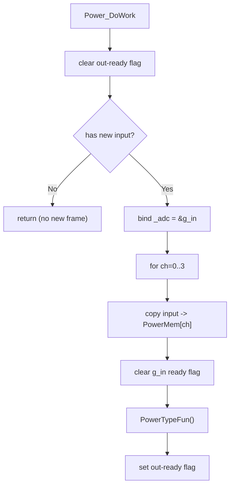

### 每帧搬运的关键字段（影响后续控制）

代码位置：[app_power.c:L6384-L6401](file:///D:/OBSIDIAN/MOVING%20IH/%E4%BD%8E%E8%80%A6%E5%90%88%E7%A8%8B%E5%BA%8F%E6%9E%B6%E6%9E%84/m4_ekf_observer/src/RX32G410_FW_HAL_V1.3N/Projects/LIB/APP/app_power.c#L6384-L6401)

- `PowerMem[ch].staticReg->current16`：谐振电流（来源按编译开关 `CurrentFromTxa` 在 TXA/POWER 组之间切）
- `PowerMem[ch].input->status.currentAd`：由 `current16` 右移缩放（`>>2` 或 `>>4`）
- `PowerMem[ch].input->status.voltageAd`：电压 ADC（`AdcGroupVoltage >> 4`）
- `PowerMem[ch].staticReg->phaseValue`：相位（`AdcGroupPhase1+ch`）
- `PowerMem[ch].staticReg->limitQSum`：Q 值/上桥相关量（`AdcGroupCeilQ1+ch`）
- `PowerMem[ch].staticReg->PowerTxaFact`：功率相关量（`Adc_GetPowerTxa(PotCh1+ch)` 后再 `>>6`）

### 主流程骨架：PowerTypeFun → PowerControlFun（每通道）

代码位置：

- `PowerTypeFun()`：[app_power.c:L1168-L1247](file:///D:/OBSIDIAN/MOVING%20IH/%E4%BD%8E%E8%80%A6%E5%90%88%E7%A8%8B%E5%BA%8F%E6%9E%B6%E6%9E%84/m4_ekf_observer/src/RX32G410_FW_HAL_V1.3N/Projects/LIB/APP/app_power.c#L1168-L1247)
- `PowerControlFun(chn)`：[app_power.c:L1472-L1523](file:///D:/OBSIDIAN/MOVING%20IH/%E4%BD%8E%E8%80%A6%E5%90%88%E7%A8%8B%E5%BA%8F%E6%9E%B6%E6%9E%84/m4_ekf_observer/src/RX32G410_FW_HAL_V1.3N/Projects/LIB/APP/app_power.c#L1472-L1523)

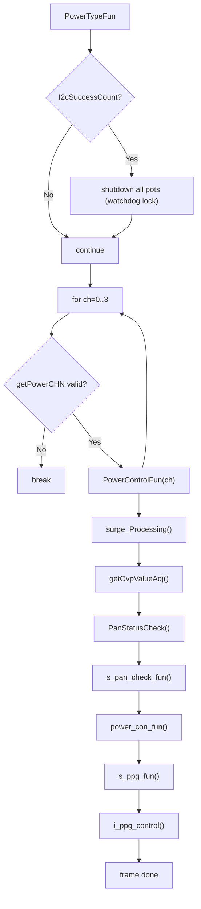

### PowerTypeFun / PowerControlFun 展开（关键链路与代码位置）

- `PowerTypeFun()` 主循环：[app_power.c:L1168-L1247](file:///D:/OBSIDIAN/MOVING%20IH/%E4%BD%8E%E8%80%A6%E5%90%88%E7%A8%8B%E5%BA%8F%E6%9E%B6%E6%9E%84/m4_ekf_observer/src/RX32G410_FW_HAL_V1.3N/Projects/LIB/APP/app_power.c#L1168-L1247)
  - `I2cSuccessCount()`：用于判定 I2C 异常（按名称理解）；异常时调用 `AdcIrqHandleWatchDogLock()` 关闭所有炉头
  - 对 `chn=0..3` 逐通道调用 `PowerControlFun(chn)`
- `PowerControlFun(chn)`：[app_power.c:L1472-L1523](file:///D:/OBSIDIAN/MOVING%20IH/%E4%BD%8E%E8%80%A6%E5%90%88%E7%A8%8B%E5%BA%8F%E6%9E%B6%E6%9E%84/m4_ekf_observer/src/RX32G410_FW_HAL_V1.3N/Projects/LIB/APP/app_power.c#L1472-L1523)
  - 浪涌：`surge_Processing()`：[app_power.c:L2331-L2345](file:///D:/OBSIDIAN/MOVING%20IH/%E4%BD%8E%E8%80%A6%E5%90%88%E7%A8%8B%E5%BA%8F%E6%9E%B6%E6%9E%84/m4_ekf_observer/src/RX32G410_FW_HAL_V1.3N/Projects/LIB/APP/app_power.c#L2331-L2345)
  - 过流门限更新：`getOvpValueAdj()`：[app_power.c:L1292](file:///D:/OBSIDIAN/MOVING%20IH/%E4%BD%8E%E8%80%A6%E5%90%88%E7%A8%8B%E5%BA%8F%E6%9E%B6%E6%9E%84/m4_ekf_observer/src/RX32G410_FW_HAL_V1.3N/Projects/LIB/APP/app_power.c#L1292)
  - 检锅状态：`PanStatusCheck()`：[app_power.c:L2167-L2214](file:///D:/OBSIDIAN/MOVING%20IH/%E4%BD%8E%E8%80%A6%E5%90%88%E7%A8%8B%E5%BA%8F%E6%9E%B6%E6%9E%84/m4_ekf_observer/src/RX32G410_FW_HAL_V1.3N/Projects/LIB/APP/app_power.c#L2167-L2214)
  - 移锅检测：`s_pan_check_fun()`：[app_power.c:L3510](file:///D:/OBSIDIAN/MOVING%20IH/%E4%BD%8E%E8%80%A6%E5%90%88%E7%A8%8B%E5%BA%8F%E6%9E%B6%E6%9E%84/m4_ekf_observer/src/RX32G410_FW_HAL_V1.3N/Projects/LIB/APP/app_power.c#L3510)
  - 控制输入→目标功率：`power_con_fun()`：[app_power.c:L2364](file:///D:/OBSIDIAN/MOVING%20IH/%E4%BD%8E%E8%80%A6%E5%90%88%E7%A8%8B%E5%BA%8F%E6%9E%B6%E6%9E%84/m4_ekf_observer/src/RX32G410_FW_HAL_V1.3N/Projects/LIB/APP/app_power.c#L2364)
  - 实际功率计算与 PID：`s_ppg_fun()`：[app_power.c:L2794](file:///D:/OBSIDIAN/MOVING%20IH/%E4%BD%8E%E8%80%A6%E5%90%88%E7%A8%8B%E5%BA%8F%E6%9E%B6%E6%9E%84/m4_ekf_observer/src/RX32G410_FW_HAL_V1.3N/Projects/LIB/APP/app_power.c#L2794)
  - 频率/占空比调整策略：`i_ppg_control()`：[app_power.c:L4152](file:///D:/OBSIDIAN/MOVING%20IH/%E4%BD%8E%E8%80%A6%E5%90%88%E7%A8%8B%E5%BA%8F%E6%9E%B6%E6%9E%84/m4_ekf_observer/src/RX32G410_FW_HAL_V1.3N/Projects/LIB/APP/app_power.c#L4152)

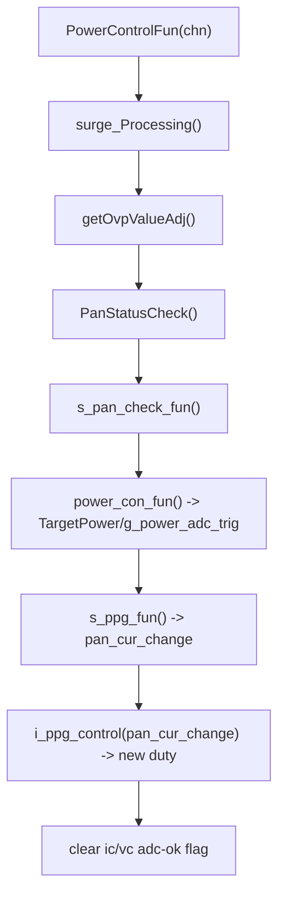

---

## 关键函数详细展开（功率闭环核心）

### power_con_fun（控制输入 → TargetPower / g_power_adc_trig）

代码位置：[app_power.c:L2364-L2512](file:///D:/OBSIDIAN/MOVING%20IH/%E4%BD%8E%E8%80%A6%E5%90%88%E7%A8%8B%E5%BA%8F%E6%9E%B6%E6%9E%84/m4_ekf_observer/src/RX32G410_FW_HAL_V1.3N/Projects/LIB/APP/app_power.c#L2364-L2512)

关键输出（按代码行为）：

- `g_power_adc_trig`：高 12 位是“目标功率 ADC”，低 4 位是“控制信息（switchTemp）”
- `TargetPower`：更新为当前通讯功率明码（`power_setm`）
- `power_half_adj`：当功率上升且幅度较大时，先用半功率逼近一段时间
- `PowerPid`：功率变化时清积分（`FixedPIDclearIntegral`）

`g_power_adc_trig` 的低 4 位含义来自代码注释（仅按本文件注释理解）：

- `0`: off
- `1`: stop_no_pan_check
- `2`: stop_with_pan_check
- `3`: heat_no_pan_check

流程图（主线 + 关键分支）：

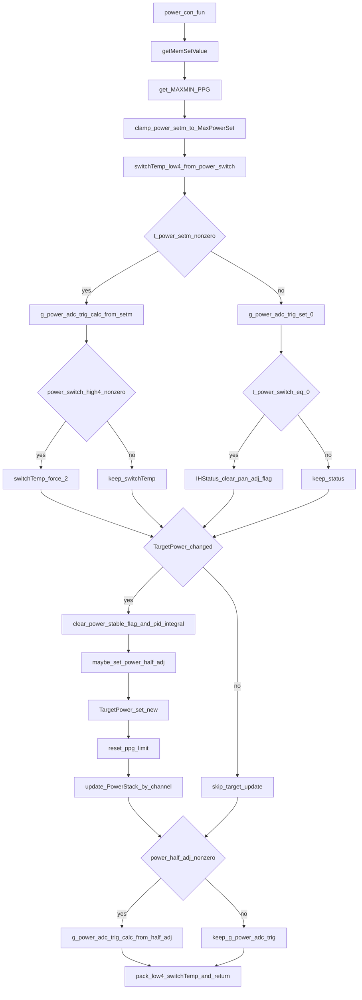

#### getMemSetValue（Flash 配置 → g_p25_ad）

代码位置：[app_power.c:L1385-L1400](file:///D:/OBSIDIAN/MOVING%20IH/%E4%BD%8E%E8%80%A6%E5%90%88%E7%A8%8B%E5%BA%8F%E6%9E%B6%E6%9E%84/m4_ekf_observer/src/RX32G410_FW_HAL_V1.3N/Projects/LIB/APP/app_power.c#L1385-L1400)

作用：从 `PowerControl->input->flash->power25` 读取“功率 25 的校准值”，并更新 `g_p25_ad`（后续用于功率换算：`ActualPower = power_adc / g_p25_ad`）。

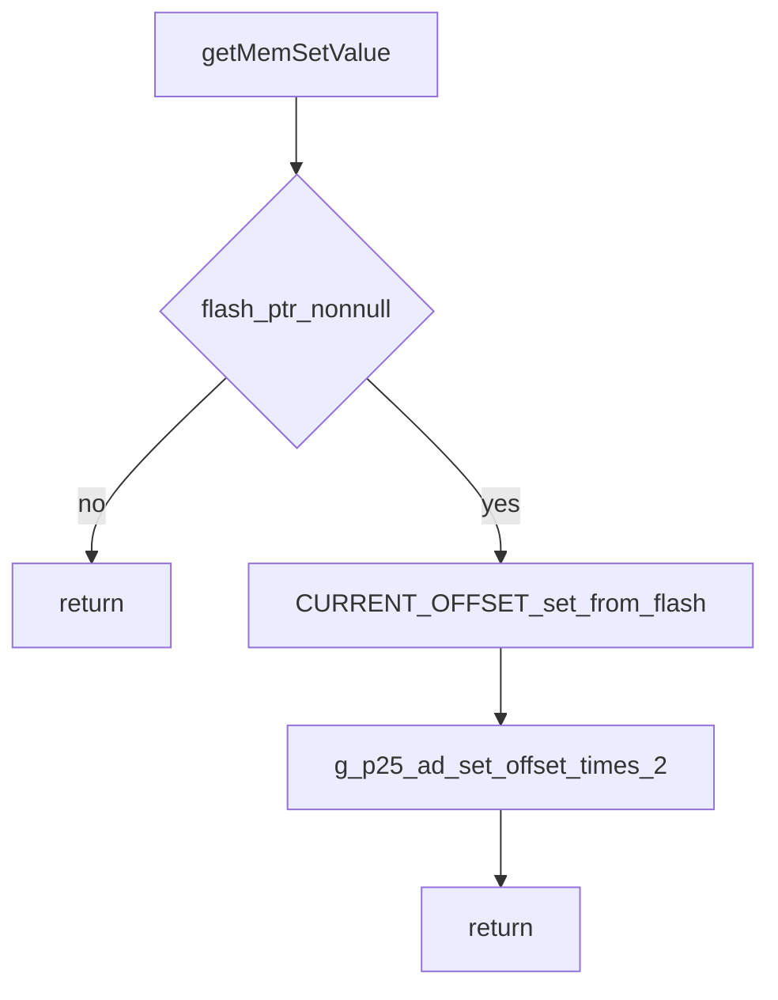

#### reset_ppg_limit（功率变化后，清限制与相位基准）

代码位置：[app_power.c:L4496-L4518](file:///D:/OBSIDIAN/MOVING%20IH/%E4%BD%8E%E8%80%A6%E5%90%88%E7%A8%8B%E5%BA%8F%E6%9E%B6%E6%9E%84/m4_ekf_observer/src/RX32G410_FW_HAL_V1.3N/Projects/LIB/APP/app_power.c#L4496-L4518)

关键效果：

- 复位 `PowerMinFre / s_ppg_limit / s_ppg_limit_max`，并清 `g_power_limit_flag / PowerDeadCnt`
- 同时把 `PhaseController` 的基准重新初始化（`PhaseController_Init`），避免“旧相位基准”影响新功率阶段

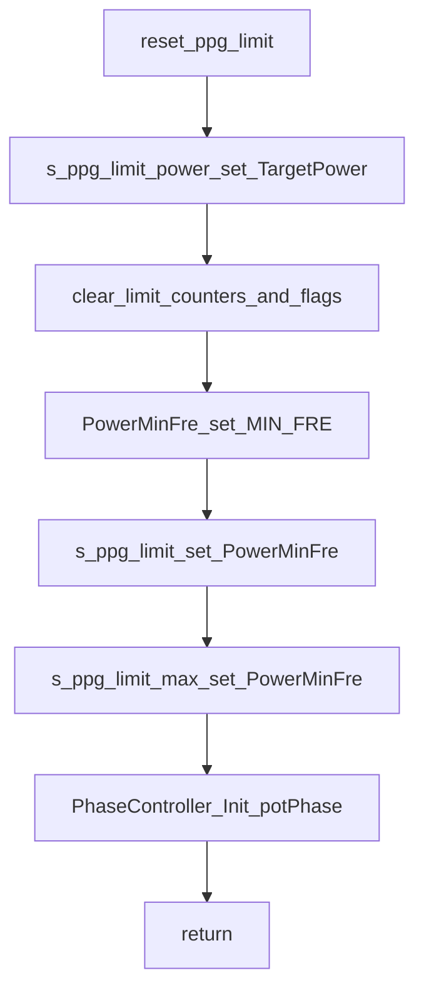

### s_ppg_fun（实际功率计算 + PID → PPG 调整量）

代码位置：[app_power.c:L2794-L3022](file:///D:/OBSIDIAN/MOVING%20IH/%E4%BD%8E%E8%80%A6%E5%90%88%E7%A8%8B%E5%BA%8F%E6%9E%B6%E6%9E%84/m4_ekf_observer/src/RX32G410_FW_HAL_V1.3N/Projects/LIB/APP/app_power.c#L2794-L3022)

关键输入/依赖（按代码读到的全局变量）：

- `g_power_adc_trig`：目标功率 ADC（由 `power_con_fun` 生成）
- `CurrentValue / VoltageValue`：当前电流/电压测量值
- `g_p25_ad`：功率换算因子（来自 `getMemSetValue`）
- `m_ic_vc_adc_ok_flag`：采样就绪门控，未就绪时直接返回 `0xff`
- `m_ppg_on`：未加热时直接返回 `0xff`

关键输出：

- 返回值为 `t_tem_ppg_add`（低 7 位是变化量，最高位 `0x80` 表示“减小方向”）
- 更新 `ActualPower / g_power_adc_fact / PidReturn[Power_channel]`
- 维护“死区判稳”标志 `B_PWDEAD`，并驱动倍频/同频切换逻辑（`APP_POWER_PpgHalfTypeSet`）

流程图（主线 + 编码）：

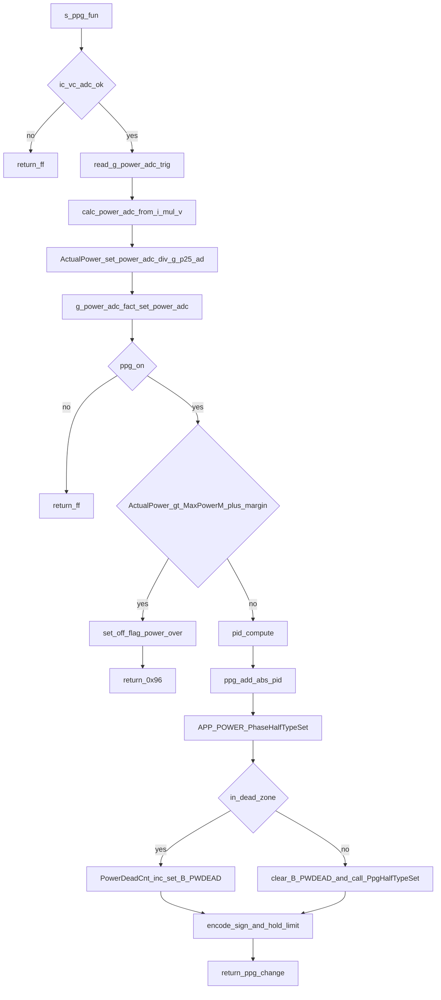

#### APP_POWER_PhaseHalfTypeSet（相位限制 → 锁升/锁降）

代码位置：[app_power.c:L2591-L2658](file:///D:/OBSIDIAN/MOVING%20IH/%E4%BD%8E%E8%80%A6%E5%90%88%E7%A8%8B%E5%BA%8F%E6%9E%B6%E6%9E%84/m4_ekf_observer/src/RX32G410_FW_HAL_V1.3N/Projects/LIB/APP/app_power.c#L2591-L2658)

输出：通过 `m_power_hold_max / m_power_hold_min` 限制 PPG 的增减方向（避免相位过小或电流过大时继续把系统推向不稳定区域）。

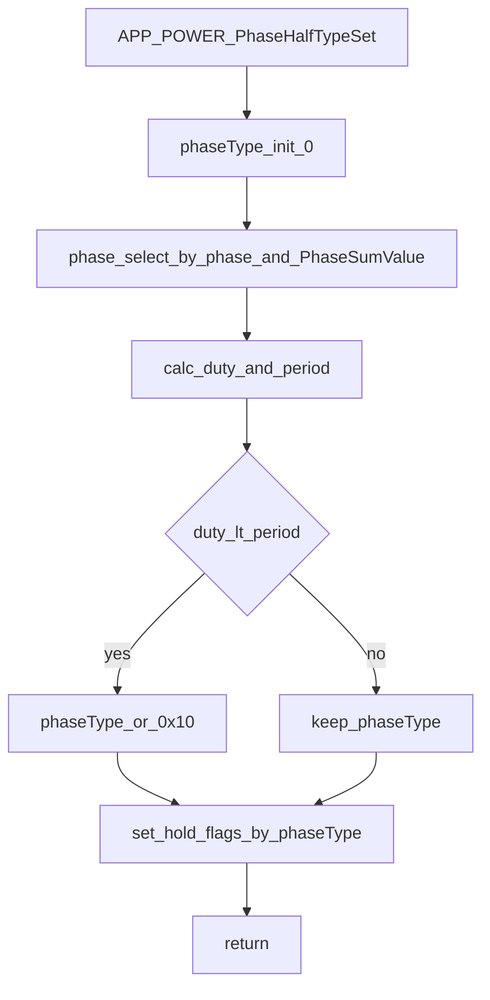

#### APP_POWER_PpgHalfTypeSet（倍频/同频切换策略）

代码位置：[app_power.c:L2666-L2767](file:///D:/OBSIDIAN/MOVING%20IH/%E4%BD%8E%E8%80%A6%E5%90%88%E7%A8%8B%E5%BA%8F%E6%9E%B6%E6%9E%84/m4_ekf_observer/src/RX32G410_FW_HAL_V1.3N/Projects/LIB/APP/app_power.c#L2666-L2767)

作用（按代码逻辑）：

- `m_power_cycle_flag==0` 表示同频（base），`m_power_cycle_flag==1` 表示倍频（double）
- 当同频且 duty 已接近最小还需要继续降功率时，满足条件会延时后切倍频
- 当倍频且 duty 已接近上限还需要继续加功率时，会延时后回同频

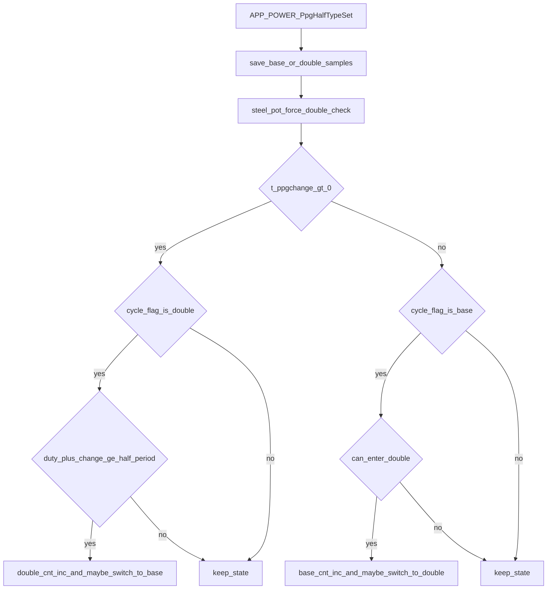

### i_ppg_control（应用 PPG 调整量 + 限幅 → 输出新 duty）

代码位置：[app_power.c:L4152-L4355](file:///D:/OBSIDIAN/MOVING%20IH/%E4%BD%8E%E8%80%A6%E5%90%88%E7%A8%8B%E5%BA%8F%E6%9E%B6%E6%9E%84/m4_ekf_observer/src/RX32G410_FW_HAL_V1.3N/Projects/LIB/APP/app_power.c#L4152-L4355)

关键输入：

- `t_pan_cur_change`：来自 `s_ppg_fun` 的返回值
  - `0xff`：不调整
  - bit7：方向（1=减小，0=增大）
  - bit6..0：变化量
- `g_surge_delay / vcout_delay`：起振与过流后的节流逻辑（过流后约 1s 不允许快速增加）
- `s_ppg_limit / s_ppg_limit_max / PowerMinFre`：PPG 限制值

流程图（应用变化量 + 限幅 + 输出）：

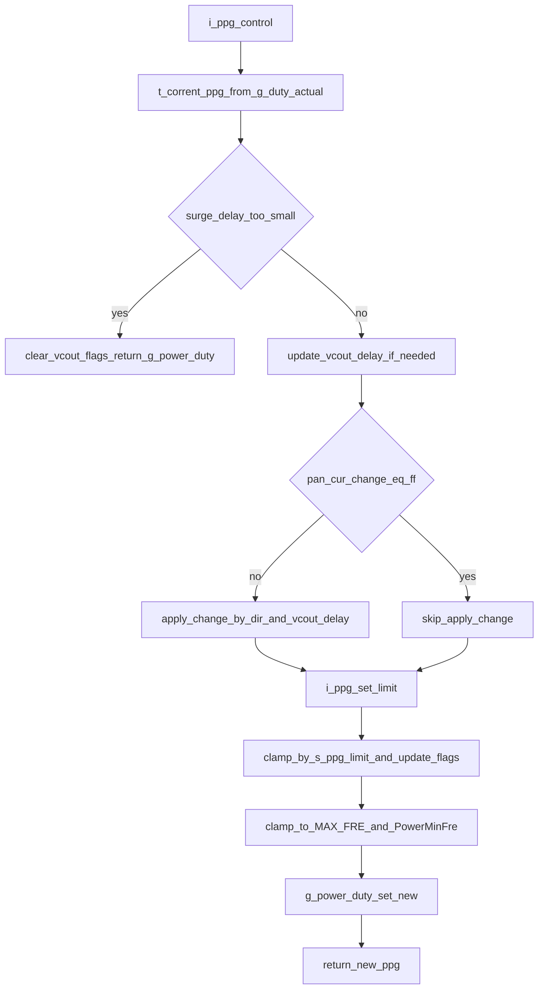

#### i_ppg_set_limit（死区稳定后，动态收紧/放宽 PPG 上限）

代码位置：[app_power.c:L4379-L4458](file:///D:/OBSIDIAN/MOVING%20IH/%E4%BD%8E%E8%80%A6%E5%90%88%E7%A8%8B%E5%BA%8F%E6%9E%B6%E6%9E%84/m4_ekf_observer/src/RX32G410_FW_HAL_V1.3N/Projects/LIB/APP/app_power.c#L4379-L4458)

启用条件（按代码判断）：

- 已判稳：`g_power_limit_flag & B_PWDEAD`
- 未发生新的功率切换：`TargetPower == s_ppg_limit_power` 且 `power_half_adj == 0`
- 运行时间足够长：`g_surge_delay > C_KEEP_TIME + POT_TYPE_DELAY2`

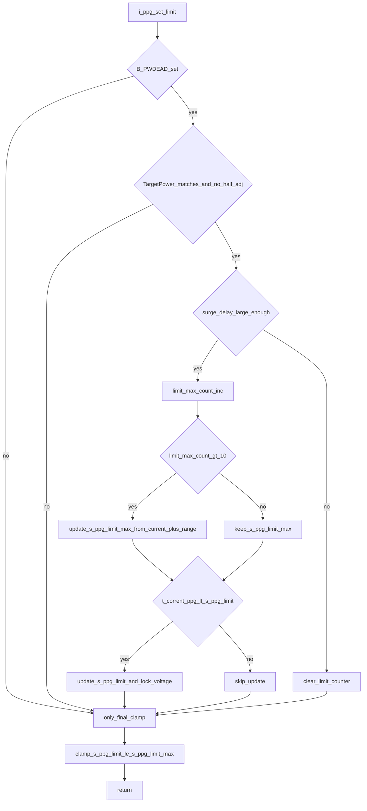

---

## 中断/回调入口（事件驱动）

### 过零点路径：powerZeroChange（PPG 开关/重启 + 同步准备）

代码位置：[app_power.c:L4818-L4917](file:///D:/OBSIDIAN/MOVING%20IH/%E4%BD%8E%E8%80%A6%E5%90%88%E7%A8%8B%E5%BA%8F%E6%9E%B6%E6%9E%84/m4_ekf_observer/src/RX32G410_FW_HAL_V1.3N/Projects/LIB/APP/app_power.c#L4818-L4917)

关键效果：

- 逐炉头调用 `power_zero_adjust(chn)`：在过零点做“起振/关断”动作，并汇总是否需要重新检锅/同步
- 若需要检锅/切换：所有炉头强制回到最小功率启动、重新同步、重置检锅相关状态
- 设置 `PowerChangeStatus=POWER_CHANGE_ZERO`：为后续 `APP_ADC_IRQ_PPGstepChangeCallBack` 的状态机提供起点
- 按多个炉头的最大风机档位设置风机，并据此决定是否开启 SCR（通过 `PowerScrCnt`）
- 逐炉头更新死区（`PowerDeatTimeSet(i)`）

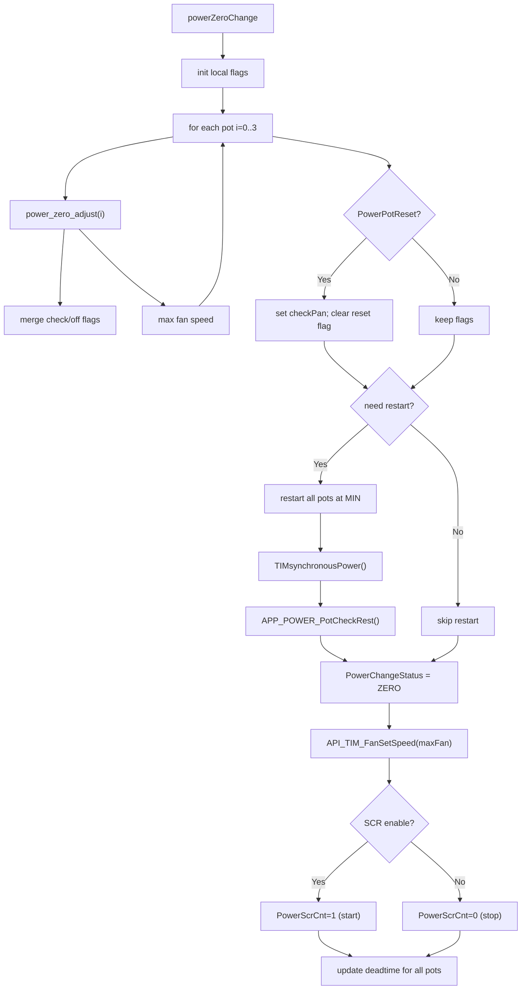

`power_zero_adjust(chn)` 的关键动作见 [app_power.c:L4586-L4660](file:///D:/OBSIDIAN/MOVING%20IH/%E4%BD%8E%E8%80%A6%E5%90%88%E7%A8%8B%E5%BA%8F%E6%9E%B6%E6%9E%84/m4_ekf_observer/src/RX32G410_FW_HAL_V1.3N/Projects/LIB/APP/app_power.c#L4586-L4660)：

- 若 `m_dis_voltage_flag && !m_power_pause_flag && !m_power_off_flag`：执行 `powerOnSetMIN()`、`API_HRTIM_MasterSync_SetPeriod(PowerCycle)`、`FunDeadTimeSetValue()`、`FunPPGonOff(PPG_ON)`，并清 `m_dis_voltage_flag`
- 若 `m_power_off_flag`：执行 `FunPPGsetDuty(OFF_FRE_PWM)`、`FunPPGonOff(PPG_OFF)`，可能置位 `m_check_pan_flag`，并清 `m_power_off_flag`

### 调频/同步更新：APP_ADC_IRQ_PPGstepChangeCallBack（HRTIM UDP 中断中的状态机）

代码位置：[app_power.c:L5610-L5775](file:///D:/OBSIDIAN/MOVING%20IH/%E4%BD%8E%E8%80%A6%E5%90%88%E7%A8%8B%E5%BA%8F%E6%9E%B6%E6%9E%84/m4_ekf_observer/src/RX32G410_FW_HAL_V1.3N/Projects/LIB/APP/app_power.c#L5610-L5775)

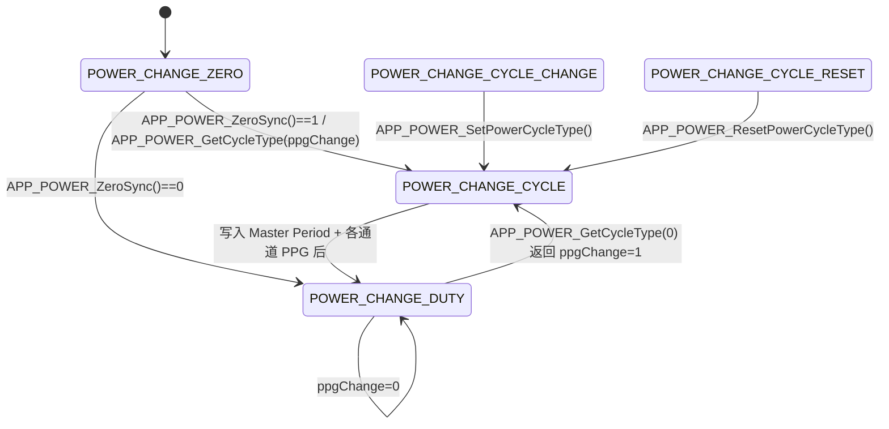

- `APP_POWER_ZeroSync()`：[app_power.c:L5311-L5393](file:///D:/OBSIDIAN/MOVING%20IH/%E4%BD%8E%E8%80%A6%E5%90%88%E7%A8%8B%E5%BA%8F%E6%9E%B6%E6%9E%84/m4_ekf_observer/src/RX32G410_FW_HAL_V1.3N/Projects/LIB/APP/app_power.c#L5311-L5393)
- `APP_POWER_GetCycleType()`：[app_power.c:L5396-L5518](file:///D:/OBSIDIAN/MOVING%20IH/%E4%BD%8E%E8%80%A6%E5%90%88%E7%A8%8B%E5%BA%8F%E6%9E%B6%E6%9E%84/m4_ekf_observer/src/RX32G410_FW_HAL_V1.3N/Projects/LIB/APP/app_power.c#L5396-L5518)
- HRTIM 写入分支（`POWER_CHANGE_CYCLE_Line`）：[app_power.c:L5736-L5755](file:///D:/OBSIDIAN/MOVING%20IH/%E4%BD%8E%E8%80%A6%E5%90%88%E7%A8%8B%E5%BA%8F%E6%9E%B6%E6%9E%84/m4_ekf_observer/src/RX32G410_FW_HAL_V1.3N/Projects/LIB/APP/app_power.c#L5736-L5755)

### 过流保护 ISR 链（AWD → CMP → 降 PPG）

入口：

- `API_ADC_Current1AWD_IRQHandlerCallBack()`：[app_power.c:L131-L140](file:///D:/OBSIDIAN/MOVING%20IH/%E4%BD%8E%E8%80%A6%E5%90%88%E7%A8%8B%E5%BA%8F%E6%9E%B6%E6%9E%84/m4_ekf_observer/src/RX32G410_FW_HAL_V1.3N/Projects/LIB/APP/app_power.c#L131-L140)
- `API_ADC_Current2AWD_IRQHandlerCallBack()`：[app_power.c:L143-L152](file:///D:/OBSIDIAN/MOVING%20IH/%E4%BD%8E%E8%80%A6%E5%90%88%E7%A8%8B%E5%BA%8F%E6%9E%B6%E6%9E%84/m4_ekf_observer/src/RX32G410_FW_HAL_V1.3N/Projects/LIB/APP/app_power.c#L143-L152)
- `API_HRTIM1_TEST_CMP1_IRQHandlerCallback()`：[app_power.c:L113-L128](file:///D:/OBSIDIAN/MOVING%20IH/%E4%BD%8E%E8%80%A6%E5%90%88%E7%A8%8B%E5%BA%8F%E6%9E%B6%E6%9E%84/m4_ekf_observer/src/RX32G410_FW_HAL_V1.3N/Projects/LIB/APP/app_power.c#L113-L128)
- `APP_ADC_IRQ_PPGstepDecTxA()`：[app_power.c:L6114-L6162](file:///D:/OBSIDIAN/MOVING%20IH/%E4%BD%8E%E8%80%A6%E5%90%88%E7%A8%8B%E5%BA%8F%E6%9E%B6%E6%9E%84/m4_ekf_observer/src/RX32G410_FW_HAL_V1.3N/Projects/LIB/APP/app_power.c#L6114-L6162)
- `PowerStepDec()`：[app_power.c:L5163-L5188](file:///D:/OBSIDIAN/MOVING%20IH/%E4%BD%8E%E8%80%A6%E5%90%88%E7%A8%8B%E5%BA%8F%E6%9E%B6%E6%9E%84/m4_ekf_observer/src/RX32G410_FW_HAL_V1.3N/Projects/LIB/APP/app_power.c#L5163-L5188)

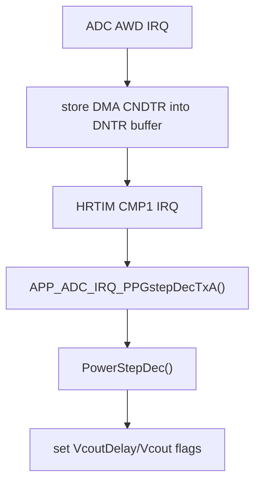

### FMAC 完成回调：API_FMAC_AppPowerOverCallBack

代码位置：[app_power.c:L6197-L6200](file:///D:/OBSIDIAN/MOVING%20IH/%E4%BD%8E%E8%80%A6%E5%90%88%E7%A8%8B%E5%BA%8F%E6%9E%B6%E6%9E%84/m4_ekf_observer/src/RX32G410_FW_HAL_V1.3N/Projects/LIB/APP/app_power.c#L6197-L6200)

- 仅设置 `PanPluse.res=PanFmacEnd`，把“FMAC 滤波结束”转换成一个可被轮询消费的事件标志

---

## 独立函数（初始化/通信/检锅/遥测/工具）

### 初始化：u_power_init / PowerMemInit

代码位置：

- `u_power_init()`：[app_power.c:L5099-L5160](file:///D:/OBSIDIAN/MOVING%20IH/%E4%BD%8E%E8%80%A6%E5%90%88%E7%A8%8B%E5%BA%8F%E6%9E%B6%E6%9E%84/m4_ekf_observer/src/RX32G410_FW_HAL_V1.3N/Projects/LIB/APP/app_power.c#L5099-L5160)
- `PowerMemInit()`：[app_power.c:L4945-L4965](file:///D:/OBSIDIAN/MOVING%20IH/%E4%BD%8E%E8%80%A6%E5%90%88%E7%A8%8B%E5%BA%8F%E6%9E%B6%E6%9E%84/m4_ekf_observer/src/RX32G410_FW_HAL_V1.3N/Projects/LIB/APP/app_power.c#L4945-L4965)

核心行为：

- 建立 `PowerMem[0..3]` 对应的 `keepReg/staticReg/funAdr/input` 指针关系
- 对每个通道执行一次 `PowerMemInit()`：清零静态状态、装载 `g_core_para_init[8]`、初始化 PID 等
- 初始化 `PowerAll`、`PowerCycle`、`PowerStack` 等全局控制数据

### 通信：控制/初始化写入 + 状态/初始化读出

入口与代码位置：

- `API_POWER_RxControlCallback()`：[app_power.c:L4973-L4992](file:///D:/OBSIDIAN/MOVING%20IH/%E4%BD%8E%E8%80%A6%E5%90%88%E7%A8%8B%E5%BA%8F%E6%9E%B6%E6%9E%84/m4_ekf_observer/src/RX32G410_FW_HAL_V1.3N/Projects/LIB/APP/app_power.c#L4973-L4992)
- `API_POWER_RxInitCallback()`：[app_power.c:L5011-L5030](file:///D:/OBSIDIAN/MOVING%20IH/%E4%BD%8E%E8%80%A6%E5%90%88%E7%A8%8B%E5%BA%8F%E6%9E%B6%E6%9E%84/m4_ekf_observer/src/RX32G410_FW_HAL_V1.3N/Projects/LIB/APP/app_power.c#L5011-L5030)
- `API_POWER_TxStatusCallback()`：[app_power.c:L5045-L5061](file:///D:/OBSIDIAN/MOVING%20IH/%E4%BD%8E%E8%80%A6%E5%90%88%E7%A8%8B%E5%BA%8F%E6%9E%B6%E6%9E%84/m4_ekf_observer/src/RX32G410_FW_HAL_V1.3N/Projects/LIB/APP/app_power.c#L5045-L5061)
- `API_POWER_TxInitCallback()`：[app_power.c:L5071-L5086](file:///D:/OBSIDIAN/MOVING%20IH/%E4%BD%8E%E8%80%A6%E5%90%88%E7%A8%8B%E5%BA%8F%E6%9E%B6%E6%9E%84/m4_ekf_observer/src/RX32G410_FW_HAL_V1.3N/Projects/LIB/APP/app_power.c#L5071-L5086)

要点：

- `RxControl`：将 `buff` 写入 `PowerMem[chn].input->control`（并受 `PotChWorkAll` 影响可能镜像到指定通道）
- `RxInit`：将 `buff` 写入 `PowerInput[chn].init`，并置位 `ihStatus|=0x80` 作为“允许回传”的门控
- `TxStatus/TxInit`：若 `ihStatus&0x80` 不成立返回 `NULL`，否则返回对应结构体指针

### 检锅：API_POWER_PanFmac / API_POWER_PanCheckPluse（DMA → FMAC → pulse_check）

入口与代码位置：

- `API_POWER_PanFmac()`：[app_power.c:L6207-L6243](file:///D:/OBSIDIAN/MOVING%20IH/%E4%BD%8E%E8%80%A6%E5%90%88%E7%A8%8B%E5%BA%8F%E6%9E%B6%E6%9E%84/m4_ekf_observer/src/RX32G410_FW_HAL_V1.3N/Projects/LIB/APP/app_power.c#L6207-L6243)
- `API_POWER_PanCheckPluse()`：[app_power.c:L6293-L6317](file:///D:/OBSIDIAN/MOVING%20IH/%E4%BD%8E%E8%80%A6%E5%90%88%E7%A8%8B%E5%BA%8F%E6%9E%B6%E6%9E%84/m4_ekf_observer/src/RX32G410_FW_HAL_V1.3N/Projects/LIB/APP/app_power.c#L6293-L6317)

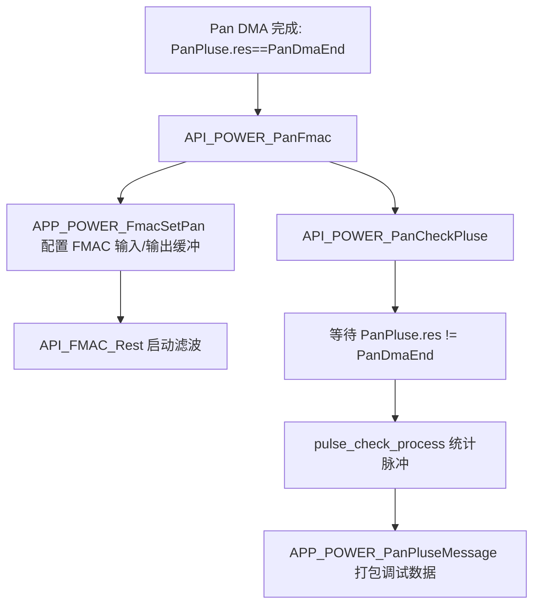

`API_POWER_PanCheckPluse()` 内部有 `while(PanPluse.res==PanDmaEnd);` 忙等点：[app_power.c:L6306-L6310](file:///D:/OBSIDIAN/MOVING%20IH/%E4%BD%8E%E8%80%A6%E5%90%88%E7%A8%8B%E5%BA%8F%E6%9E%B6%E6%9E%84/m4_ekf_observer/src/RX32G410_FW_HAL_V1.3N/Projects/LIB/APP/app_power.c#L6306-L6310)

### 遥测：API_POWER_EKF_GetTelemetry（MODBUS 读前填充）

代码位置：[app_power.c:L6335-L6366](file:///D:/OBSIDIAN/MOVING%20IH/%E4%BD%8E%E8%80%A6%E5%90%88%E7%A8%8B%E5%BA%8F%E6%9E%B6%E6%9E%84/m4_ekf_observer/src/RX32G410_FW_HAL_V1.3N/Projects/LIB/APP/app_power.c#L6335-L6366)

- 从 `PowerMem[chn]` 与 `API_PPG_getValue(chn)` 读取相位/频率/PPG/电流等，并写入 `EKF_Telemetry_t`
- 频率换算：`freq_hz = 384000000 / ppg.prioed * 2`（按代码注释为“半桥倍频”）

### 时间片输出：API_POWER_ScrOutput（按 TskId 分时控制 SCR）

代码位置：[app_power.c:L4768-L4806](file:///D:/OBSIDIAN/MOVING%20IH/%E4%BD%8E%E8%80%A6%E5%90%88%E7%A8%8B%E5%BA%8F%E6%9E%B6%E6%9E%84/m4_ekf_observer/src/RX32G410_FW_HAL_V1.3N/Projects/LIB/APP/app_power.c#L4768-L4806)

- `scrOn` 来源：`(PowerMem[0].input->init.minPhase >> 4) & 0x0F`，若 `scrOn>=10` 则归零
- 当 `scrOn == TskId` 时，根据 `PowerScrCnt` 的递增区间调用 `API_TIM_ScrSetSpeed(0/75/55)` 输出不同强度（仅按名称理解）
