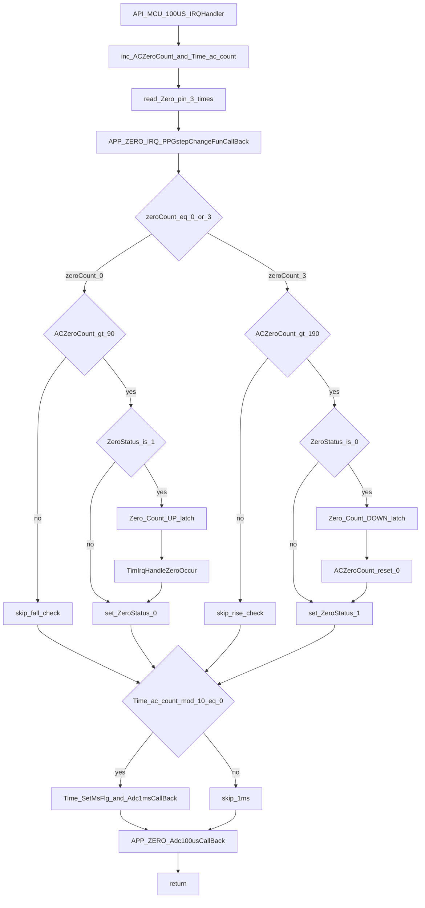
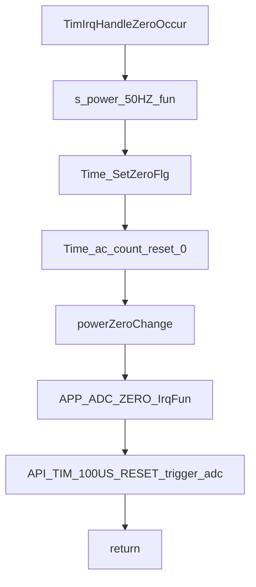
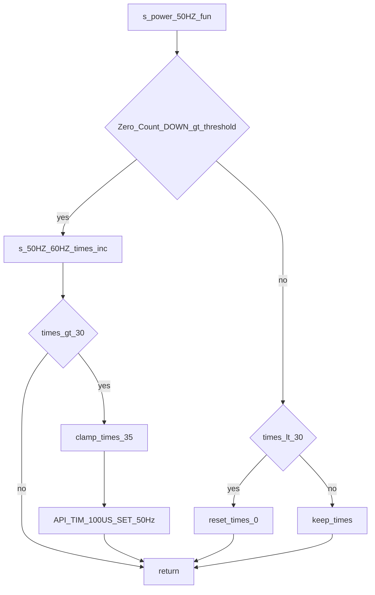

# APP/POWER/APP_ZERO.C 流程分解

目标：基于 [APP_ZERO.C](file:///D:/OBSIDIAN/MOVING%20IH/%E4%BD%8E%E8%80%A6%E5%90%88%E7%A8%8B%E5%BA%8F%E6%9E%B6%E6%9E%84/m4_ekf_observer/src/RX32G410_FW_HAL_V1.3N/Projects/APP/POWER/src/APP_ZERO.C)（必要时参考头 [APP_ZERO.H](file:///D:/OBSIDIAN/MOVING%20IH/%E4%BD%8E%E8%80%A6%E5%90%88%E7%A8%8B%E5%BA%8F%E6%9E%B6%E6%9E%84/m4_ekf_observer/src/RX32G410_FW_HAL_V1.3N/Projects/APP/POWER/inc/APP_ZERO.H)）生成“100us 时基中断 → 过零检测 → 过零事件分发 → 50/60Hz 自适应”的流程图与调用链说明。

## 职责（按代码行为抽象）

- 提供 100us 时基中断入口 `API_MCU_100US_IRQHandler()`，作为系统 100us tick
- 在 100us tick 内对 `Zero_pin` 进行去抖采样并判定“上升沿/下降沿”
- 过零点到达时触发：
  - 系统时间基准清零（`Time_SetZeroFlg`、`Time_ac_count=0`）
  - 功率侧过零处理（`powerZeroChange()`）
  - ADC 侧过零处理（`APP_ADC_ZERO_IrqFun()`）
  - 立即触发一次 ADC（`API_TIM_100US_RESET()`）
- 根据 `Zero_Count_DOWN` 宽度粗判 50Hz/60Hz，并切换 100us 定时基准（`API_TIM_100US_SET_50Hz()`）

## 外部依赖（按名称标注）

- `s_time_base.h`：时间标志位与计数（`Time_SetMsFlg`、`Time_SetZeroFlg`）
- `API_gpio.h`：读取 `Zero_pin`（`API_GPIO_ReadPin`）
- `API_TIM.h`：100us 定时器相关（`API_TIM_100US_RESET`、`API_TIM_100US_SET_50Hz`）
- `API_ADC.h`：ADC 触发/中断开关（当前文件中以 include 为主）
- `APP_ADC.H`：过零回调 `APP_ADC_ZERO_IrqFun()`（弱符号，通常由 APP_ADC 强实现）
- `app_power.h`：`powerZeroChange()`（功率侧过零状态机推进）

## 关键数据结构（去抖与宽度测量）

代码位置：[APP_ZERO.C:L120-L145](file:///D:/OBSIDIAN/MOVING%20IH/%E4%BD%8E%E8%80%A6%E5%90%88%E7%A8%8B%E5%BA%8F%E6%9E%B6%E6%9E%84/m4_ekf_observer/src/RX32G410_FW_HAL_V1.3N/Projects/APP/POWER/src/APP_ZERO.C#L120-L145)

- `zero_str.ZERO_Count_NOW`：当前电平持续宽度计数（100us 计数）
- `zero_str.ZERO_Count_UP`：高电平宽度（在下降沿处锁存）
- `zero_str.ZERO_Count_DOWN`：低电平宽度（在上升沿处锁存）
- `zero_str.ZERO_DIC`：当前电平状态（0/1）
- `zero_str.count`：自上次过零开始的计数（100us 计数）

---

## 100us Tick：API_MCU_100US_IRQHandler（去抖采样 + 边沿检测 + 回调分发）

代码位置：[APP_ZERO.C:L149-L247](file:///D:/OBSIDIAN/MOVING%20IH/%E4%BD%8E%E8%80%A6%E5%90%88%E7%A8%8B%E5%BA%8F%E6%9E%B6%E6%9E%84/m4_ekf_observer/src/RX32G410_FW_HAL_V1.3N/Projects/APP/POWER/src/APP_ZERO.C#L149-L247)

### 去抖策略（按代码字面）

- 在同一个 100us IRQ 内对 `Zero_pin` 连读 3 次
- `zeroCount==3` 认为是稳定高，`zeroCount==0` 认为是稳定低
- 通过阈值 `ACZeroCount>190` / `ACZeroCount>90` 限制边沿判定时机（避免毛刺）

### 流程图（主线）

---

## 过零事件：TimIrqHandleZeroOccur（50/60Hz 判定 + 业务分发 + 立即触发 ADC）

代码位置：[APP_ZERO.C:L305-L325](file:///D:/OBSIDIAN/MOVING%20IH/%E4%BD%8E%E8%80%A6%E5%90%88%E7%A8%8B%E5%BA%8F%E6%9E%B6%E6%9E%84/m4_ekf_observer/src/RX32G410_FW_HAL_V1.3N/Projects/APP/POWER/src/APP_ZERO.C#L305-L325)

关键动作（按顺序）：

- `s_power_50HZ_fun()`：根据 `Zero_Count_DOWN` 粗判 50Hz/60Hz，必要时切换 100us 定时器
- `Time_SetZeroFlg()` + `Time_ac_count=0`：同步系统时基（过零对齐）
- `powerZeroChange()`：功率侧过零状态机推进
- `APP_ADC_ZERO_IrqFun()`：ADC 侧过零同步（典型用途：复位 20ms 采样计数，切换 ADC 组等）
- `API_TIM_100US_RESET()`：立刻触发一次 ADC（注释：更新计数器马上触发 ADC）

---

## 50Hz/60Hz 自适应：s_power_50HZ_fun（基于低电平宽度的慢速确认）

代码位置：[APP_ZERO.C:L269-L298](file:///D:/OBSIDIAN/MOVING%20IH/%E4%BD%8E%E8%80%A6%E5%90%88%E7%A8%8B%E5%BA%8F%E6%9E%B6%E6%9E%84/m4_ekf_observer/src/RX32G410_FW_HAL_V1.3N/Projects/APP/POWER/src/APP_ZERO.C#L269-L298)

核心判断（按代码字面）：

- 若 `Zero_Count_DOWN > AdcAvageCount+10`，认为“周期更长”，倾向 50Hz
- 连续累计 `s_50HZ_60HZ_times`，超过阈值后调用 `API_TIM_100US_SET_50Hz()` 切换定时器
- 若不满足条件并且计数未达到阈值，则清零计数（避免误触发）

---

## 弱符号回调接口（由其他模块强实现）

代码位置：[APP_ZERO.C:L93-L109](file:///D:/OBSIDIAN/MOVING%20IH/%E4%BD%8E%E8%80%A6%E5%90%88%E7%A8%8B%E5%BA%8F%E6%9E%B6%E6%9E%84/m4_ekf_observer/src/RX32G410_FW_HAL_V1.3N/Projects/APP/POWER/src/APP_ZERO.C#L93-L109)

- `APP_ZERO_IRQ_PPGstepChangeFunCallBack()`：100us 内调用（注释：PPG 逼近，自动增减），通常在 `APP_POWER` 提供强实现
- `APP_ZERO_Adc100usCallBack()`：每 100us 调用一次（ADC 侧 100us 任务）
- `APP_ZERO_Adc1msCallBack()`：每 1ms 调用一次（ADC 侧 1ms 任务）
- `APP_ADC_ZERO_IrqFun()`：在过零事件中调用（ADC 侧过零同步）

