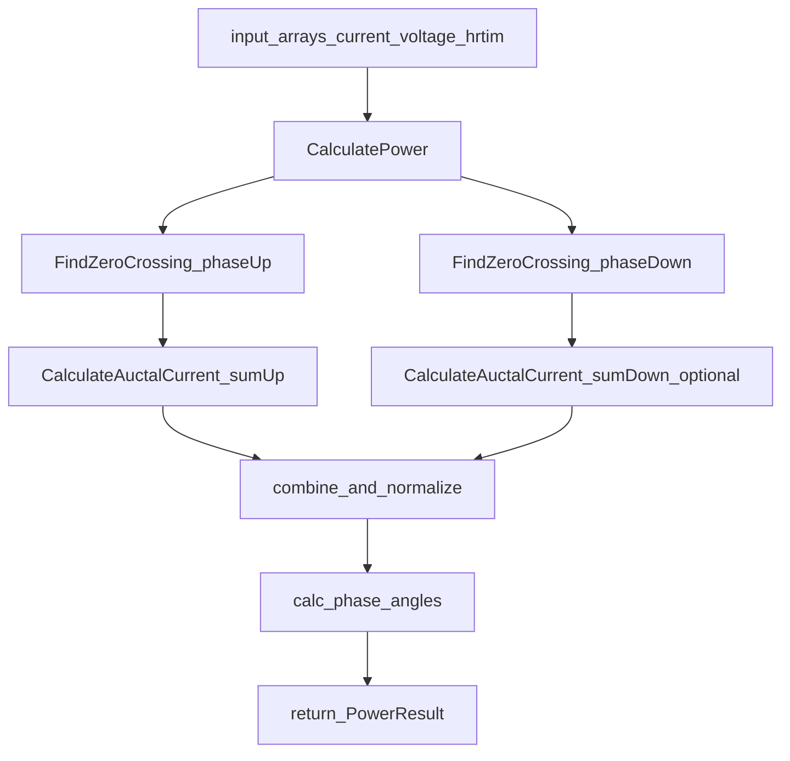
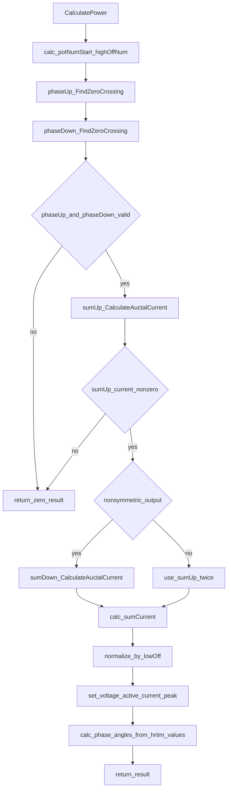
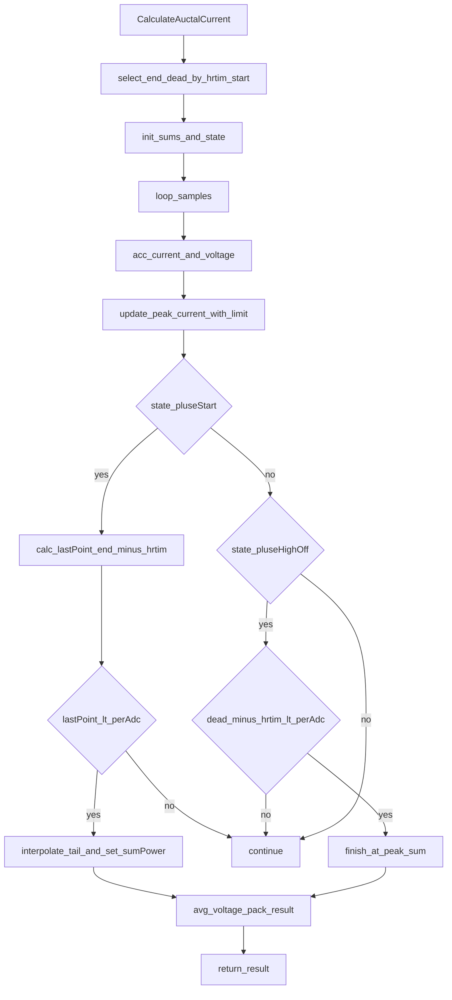
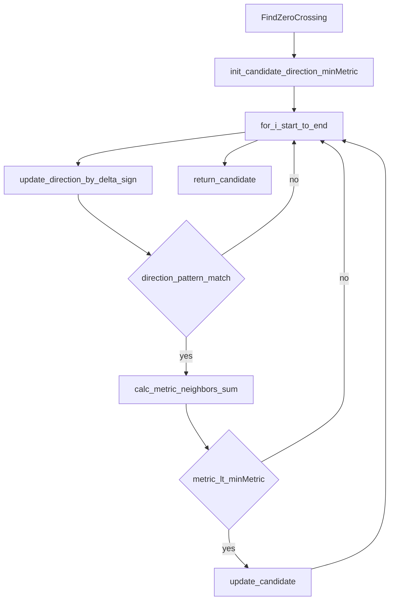

# BaseClass/power_calculator.c 流程分解（半桥）

目标：只基于 [power_calculator.c](file:///D:/OBSIDIAN/MOVING%20IH/%E4%BD%8E%E8%80%A6%E5%90%88%E7%A8%8B%E5%BA%8F%E6%9E%B6%E6%9E%84/m4_ekf_observer/src/RX32G410_FW_HAL_V1.3N/Projects/BaseClass/src/power_calculator.c)（必要时参考接口头 [power_calculator.h](file:///D:/OBSIDIAN/MOVING%20IH/%E4%BD%8E%E8%80%A6%E5%90%88%E7%A8%8B%E5%BA%8F%E6%9E%B6%E6%9E%84/m4_ekf_observer/src/RX32G410_FW_HAL_V1.3N/Projects/BaseClass/inc/power_calculator.h)）生成“过零定位 → 半桥窗口积分 → 电流/相位输出”的流程图与功能流转说明。

## 外部依赖（按名称标注）

- `power_calculator.h`：核心数据结构（`PowerCalculatorInputDef` / `CalculatorResultDef` / `PowerResult`）
- `math.h`：部分 20ms/FPU 路径使用的浮点数学函数（当前文件内多处受编译开关影响）

## 入口分类（按“主函数/辅助函数/缓冲访问”）

- 主函数（1ms 单周期快速路径）：
  - `CalculatePower()`：单周期功率/电流/相位计算入口（半桥）
  - `CalculateAuctalCurrent()`：在单个导通窗口内做电流积分与电压平均，并计算峰值电流
- 辅助函数：
  - `FindZeroCrossing()`：在给定区间内寻找过零点（相位点）
- 数据缓冲区访问（测试/联调用）：
  - `Power_Calculator_GetHrtimBuffAddress()` / `Power_Calculator_GetVoltageBuffAddress()`
  - `Power_Calculator_GetTxaBuffAddress()` / `Power_Calculator_GetTxaBuffSize()`
  - `Power_Calculator_GetInputArrayAddress()`
- 20ms 电参数路径：
  - `CalculateElecParams_20ms()`：存在于文件中，但其编译受宏开关影响（见源码条件编译块）

---

## 总体数据流（采样数组 → 算法输出）

输入数组（每个采样点一组数据）：

- `resonant_current[num]`：谐振电流 ADC（单路）
- `voltage_values[num]`：母线电压 ADC（单路）
- `hrtim_values[num]`：HRTIM 计数器采样（单路，半桥只需 1 个计数器）

输出（`PowerResult`，主要字段）：

- `active_current`：周期归一后的有效电流（整数定标）
- `voltage`：窗口内电压平均（整数）
- `peak_current`：窗口内峰值电流（整数）
- `phase_angleUp/phase_angleDown`：上下管相位角（度×10，按 `PHASE_DEG_BASE/180` 路径）
- `zero_cross_high/zero_cross_low`：代码中记录为 HRTIM 计数值（不是“索引差值”）

---

## 主函数：CalculatePower（过零点定位 + 窗口积分 + 相位输出）

代码位置：[power_calculator.c:L977-L1127](file:///D:/OBSIDIAN/MOVING%20IH/%E4%BD%8E%E8%80%A6%E5%90%88%E7%A8%8B%E5%BA%8F%E6%9E%B6%E6%9E%84/m4_ekf_observer/src/RX32G410_FW_HAL_V1.3N/Projects/BaseClass/src/power_calculator.c#L977-L1127)

### 关键步骤（按代码逻辑）

- Step1：把 HRTIM 时间点换算到“数组序号空间”
  - `potNumStart = input->start + 4`
  - `highOffNum = input->highOff / perAdc + potNumStart`
- Step2：在两个区间找过零点（用电流波形）
  - `phaseUp = FindZeroCrossing(resonant_current, potNumStart, highOffNum+2)`
  - `phaseDown = FindZeroCrossing(resonant_current, highOffNum, input->end)`
- Step3：在过零点起算，做导通窗口积分
  - `sumUp = CalculateAuctalCurrent(..., phaseUp, input)`
  - 若非对称输出，则再计算 `sumDown`；否则用 `sumUp*2` 近似
- Step4：按 `input->lowOff` 做周期归一，输出 `active_current`、`voltage`、`peak_current`，并用 `hrtim_values[phaseUp/phaseDown]` 输出相位角

### 流程图（主线）

---

## 窗口积分：CalculateAuctalCurrent（半桥导通段积分 + 峰值 + 关断点插值）

代码位置：[power_calculator.c:L838-L960](file:///D:/OBSIDIAN/MOVING%20IH/%E4%BD%8E%E8%80%A6%E5%90%88%E7%A8%8B%E5%BA%8F%E6%9E%B6%E6%9E%84/m4_ekf_observer/src/RX32G410_FW_HAL_V1.3N/Projects/BaseClass/src/power_calculator.c#L838-L960)

### 半桥窗口判定（high 与 low 两个区间）

函数入口 `start` 处，如果 `hrtim_values[start] > input->highOff`，则认为当前在“下管窗口”，并改用：

- `end = input->lowOff`
- `dead = input->highOn`

否则认为在“上管窗口”，使用：

- `end = input->highOff`
- `dead = input->lowOn`

### 关键步骤（按代码逻辑）

- Step1：从 `start` 开始累加 `currentSum` 与 `vcSum`，并跟踪峰值 `currentMax`
- Step2：状态机 `currentType`（只用到两个关键状态）：
  - `pluseStart`：主要积分区，检测是否接近关断点（`lastPoint = end - hrtim`）
  - `pluseHighOff`：用于等待到达对管开通（死区结束附近），将积分截止到峰值出现点
- Step3：关断点插值：
  - 当 `lastPoint < perAdc` 时，按 `lastPoint * newValue` 把末端不完整采样点按比例计入
  - `currentSumPower = currentSum * perAdc + lastPoint * newValue`
- Step4：输出：
  - `result.current = currentSumPower`
  - `result.voltage = vcSum / vcCnt`
  - `result.peak_current = currentMax`

### 流程图（积分主线）

---

## 过零定位：FindZeroCrossing（区间内候选点选择）

代码位置：[power_calculator.c:L764-L830](file:///D:/OBSIDIAN/MOVING%20IH/%E4%BD%8E%E8%80%A6%E5%90%88%E7%A8%8B%E5%BA%8F%E6%9E%B6%E6%9E%84/m4_ekf_observer/src/RX32G410_FW_HAL_V1.3N/Projects/BaseClass/src/power_calculator.c#L764-L830)

行为抽象：

- 用 `direction` 记录相邻采样差分的符号变化
- 当检测到“拐点模式”时，取 `phasePoint=i-1`，比较 `current[phasePoint-1] + current[phasePoint+1]`，选择最小者作为 candidate

---

## 20ms 电参数计算：CalculateElecParams_20ms（简要）

代码位置（条件编译块中）：[power_calculator.c:L1420-L1525](file:///D:/OBSIDIAN/MOVING%20IH/%E4%BD%8E%E8%80%A6%E5%90%88%E7%A8%8B%E5%BA%8F%E6%9E%B6%E6%9E%84/m4_ekf_observer/src/RX32G410_FW_HAL_V1.3N/Projects/BaseClass/src/power_calculator.c#L1420-L1525)

输入/输出：

- 输入：4 路 `current_buf/hrtim_buf/voltage_buf` + 4 路 `PowerCalculatorInputDef*`
- 输出：`ElecParamsDef elec[4]`（包含 `P_W/I_rms/I_peak/Vdc_mean/phi_deg/f_sw_kHz/f_res_kHz/Q_factor/L_uH/R_ohm/X_ohm/...` 等）

依赖链路（按源码）：内部调用 `CalculatePower_FPU(...)` 作为基础值来源，再推导频率、阻抗、电感、Q，并做 B-H 修正与 Kalman（均在同一条件编译区域附近定义）。

