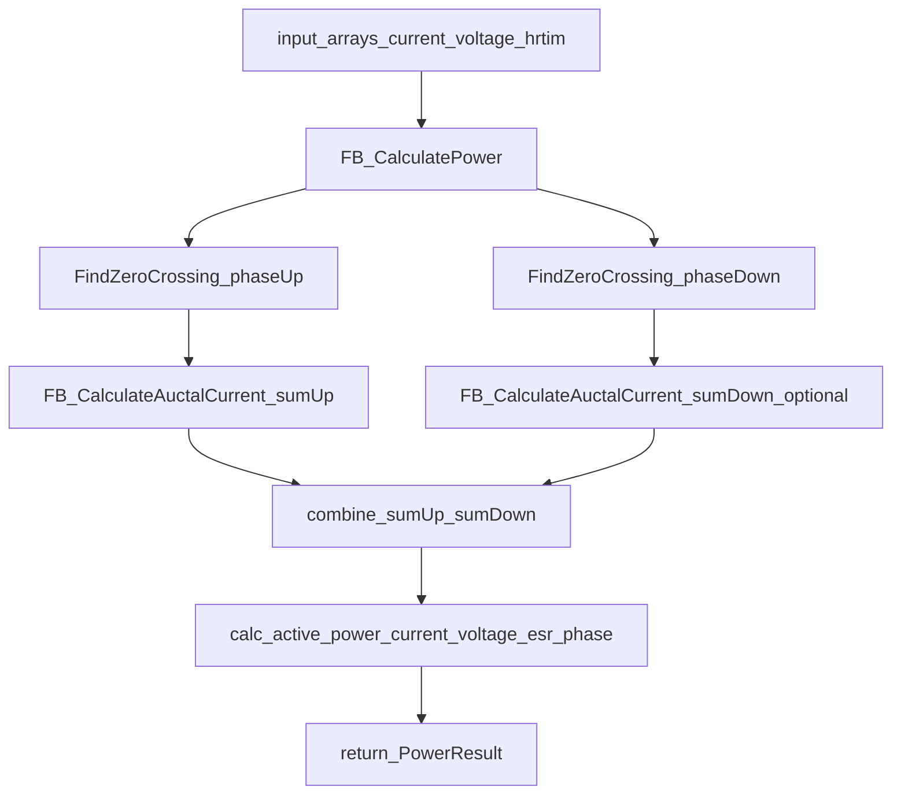
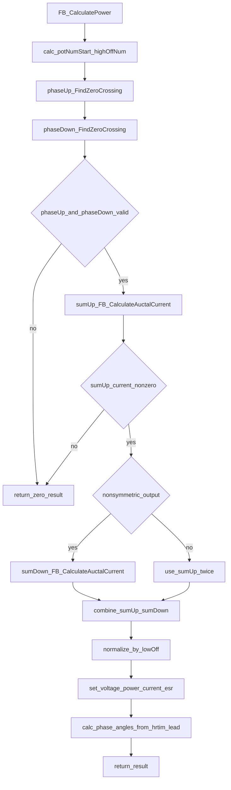
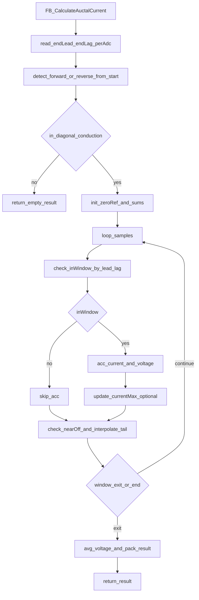
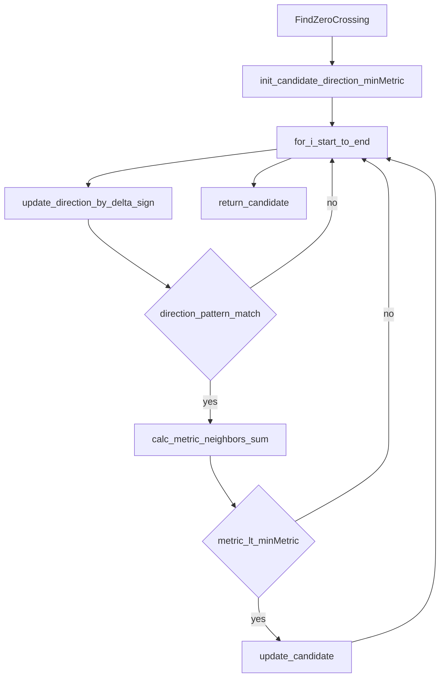

# BaseClass/power_calculator_fullbridge.c 流程分解

目标：只基于 [power_calculator_fullbridge.c](file:///D:/OBSIDIAN/MOVING%20IH/%E4%BD%8E%E8%80%A6%E5%90%88%E7%A8%8B%E5%BA%8F%E6%9E%B6%E6%9E%84/m4_ekf_observer/src/RX32G410_FW_HAL_V1.3N/Projects/BaseClass/src/power_calculator_fullbridge.c)（必要时参考接口头 [power_calculator_fullbridge.h](file:///D:/OBSIDIAN/MOVING%20IH/%E4%BD%8E%E8%80%A6%E5%90%88%E7%A8%8B%E5%BA%8F%E6%9E%B6%E6%9E%84/m4_ekf_observer/src/RX32G410_FW_HAL_V1.3N/Projects/BaseClass/inc/power_calculator_fullbridge.h) 与基础结构 [power_calculator.h](file:///D:/OBSIDIAN/MOVING%20IH/%E4%BD%8E%E8%80%A6%E5%90%88%E7%A8%8B%E5%BA%8F%E6%9E%B6%E6%9E%84/m4_ekf_observer/src/RX32G410_FW_HAL_V1.3N/Projects/BaseClass/inc/power_calculator.h)）生成“过零定位 → 双窗口积分 → 功率/相位输出”的流程图与功能流转说明。

## 外部依赖（按名称标注）

- `power_calculator.h`：复用基础数据结构（`PowerCalculatorInputDef` / `PowerResult` / `CalculatorResultDef`）
- `api_hrtim.h`：按名称理解（本文件主要消费 HRTIM 计数数组，不直接写寄存器）
- `stdlib.h`：`abs` 等基础函数

## 入口分类（按“主函数/辅助函数/缓冲访问”）

- 主函数：
  - `FB_CalculatePower()`：全桥功率计算主入口（输出 `PowerResult`）
  - `FB_CalculateAuctalCurrent()`：双 HRTIM 窗口下的电流积分/电压平均（输出 `CalculatorResultDef`）
- 辅助函数：
  - `FindZeroCrossing()`：在给定区间内寻找电流过零点（相当于“相位点”）
  - `sqrt32()`：32 位整数平方根（本文件中定义，但当前逻辑未见直接使用）
- 数据缓冲区访问：
  - `FB_Power_Calculator_GetHrtimLeadBuffAddress()` / `FB_Power_Calculator_GetHrtimLagBuffAddress()`
  - `FB_Power_Calculator_GetVoltageBuffAddress()` / `FB_Power_Calculator_GetTxaBuffAddress()`
  - `FB_Power_Calculator_GetTxaBuffSize()` / `FB_Power_Calculator_GetInputArrayAddress()`

---

## 总体数据流（DMA 采样 → 算法输出）

输入数组（每个采样点一组数据）：

- `resonant_current[num]`：谐振电流 ADC（单路）
- `voltage_values[num]`：电压 ADC（单路）
- `hrtim_lead[num]`：超前臂 HRTIM 计数器（例如 TimerB CNT）
- `hrtim_lag[num]`：滞后臂 HRTIM 计数器（例如 TimerE CNT）

输出（`PowerResult`）：

- `active_power`：有功功率（按代码最终 `sumAll >> 4` 的缩放输出）
- `active_current`：有功电流积分结果（对周期归一后）
- `voltage`：窗口内电压平均值
- `esr`：等效电阻估算（`voltage / current`）
- `phase_angleUp/phase_angleDown`、`zero_cross_high/zero_cross_low`：相位相关输出（基于过零点附近的 HRTIM 计数）

---

## 主函数：FB_CalculatePower（过零点定位 + 窗口积分 + 功率输出）

代码位置：[power_calculator_fullbridge.c:L342-L426](file:///D:/OBSIDIAN/MOVING%20IH/%E4%BD%8E%E8%80%A6%E5%90%88%E7%A8%8B%E5%BA%8F%E6%9E%B6%E6%9E%84/m4_ekf_observer/src/RX32G410_FW_HAL_V1.3N/Projects/BaseClass/src/power_calculator_fullbridge.c#L342-L426)

### 关键步骤（按代码逻辑）

- Step1：计算 `potNumStart = input->start + 4`，并把 `highOff` 换算到“数组序号空间”（`highOffNum = highOff/perAdc + potNumStart`）
- Step2：用 `FindZeroCrossing` 在两个区间内找过零点：
  - `phaseUp`：`[potNumStart, highOffNum+2)`（上管关断附近）
  - `phaseDown`：`[highOffNum, input->end)`（另一半周期）
- Step3：若 `phaseUp` 与 `phaseDown` 都有效：
  - 对 `phaseUp` 做正向窗口积分 `sumUp = FB_CalculateAuctalCurrent(...)`
  - 根据“是否非对称输出”决定是否对 `phaseDown` 再积分 `sumDown`
- Step4：用 `input->lowOff` 做周期归一，输出功率/电流/电压/ESR/相位

### 流程图（主线）

---

## 电流积分：FB_CalculateAuctalCurrent（双窗口状态判定 + 累加 + 末端修正）

代码位置：[power_calculator_fullbridge.c:L219-L336](file:///D:/OBSIDIAN/MOVING%20IH/%E4%BD%8E%E8%80%A6%E5%90%88%E7%A8%8B%E5%BA%8F%E6%9E%B6%E6%9E%84/m4_ekf_observer/src/RX32G410_FW_HAL_V1.3N/Projects/BaseClass/src/power_calculator_fullbridge.c#L219-L336)

### 核心概念：对角管导通窗口（forward/reverse）

用超前臂与滞后臂两个计数器判断对角管是否同时导通：

- forward_window：`lead < highOff` 且 `lag >= lagDuty`（电流正向，直接累加）
- reverse_window：`lead >= highOff` 且 `lag < lagDuty`（电流反向，以 `zeroRef` 为参考取绝对值再累加）

### 关键步骤（按代码逻辑）

- Step1：根据 `start` 点的 HRTIM 状态判断 `isForward`，不满足对角导通则直接返回空结果
- Step2：初始化累加 `currentSum` 与 `vcSum`
- Step3：遍历采样点：
  - 判断是否在窗口内，窗口内累加电流与电压
  - 当接近“窗口关断点”（`nearOff < perAdc`）时做末端插值修正：`currentSumPower = currentSum*perAdc + nearOff*rawValue`
- Step4：输出 `result.current=currentSumPower` 与 `result.voltage=vcSum/vcCnt`

### 流程图（窗口积分主线）

---

## 过零定位：FindZeroCrossing（区间内最优候选点）

代码位置：[power_calculator_fullbridge.c:L136-L167](file:///D:/OBSIDIAN/MOVING%20IH/%E4%BD%8E%E8%80%A6%E5%90%88%E7%A8%8B%E5%BA%8F%E6%9E%B6%E6%9E%84/m4_ekf_observer/src/RX32G410_FW_HAL_V1.3N/Projects/BaseClass/src/power_calculator_fullbridge.c#L136-L167)

按代码行为抽象：

- 对区间内每个点构造“方向 shift 寄存器”（用相邻采样差的正负）
- 当检测到方向模式满足条件时，评估 `phasePoint` 的邻域（`current[p-1] + current[p+1]`）作为“过零程度”指标
- 选择最小指标的点作为 candidate

---

## 数据缓冲区访问（测试/联调用）

代码位置：[power_calculator_fullbridge.c:L432-L461](file:///D:/OBSIDIAN/MOVING%20IH/%E4%BD%8E%E8%80%A6%E5%90%88%E7%A8%8B%E5%BA%8F%E6%9E%B6%E6%9E%84/m4_ekf_observer/src/RX32G410_FW_HAL_V1.3N/Projects/BaseClass/src/power_calculator_fullbridge.c#L432-L461)

用途：提供一组“测试数组”的访问入口（lead/lag/current/voltage/input），便于在没有真实 DMA 数据时复现实验计算链路。

