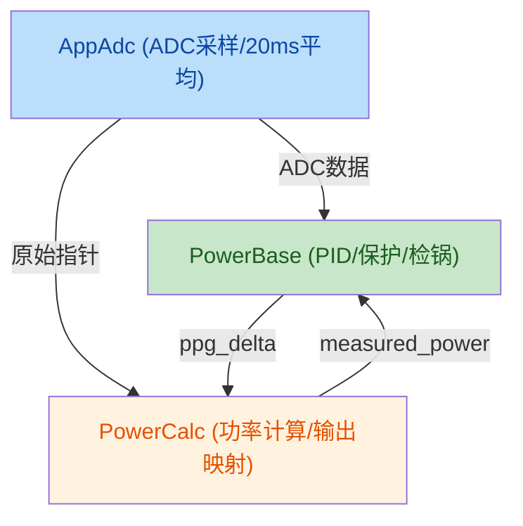

# 📋 婴儿模块架构规划审查报告

## 📌 文档信息

| 项目 | 内容 |
|------|------|
| **审查对象** | 婴儿模块架构 — 半桥/全桥统一方案 |
| **原文档路径** | `docs/generic-sleeping-metcalfe.md` |
| **审查日期** | 2026-06-08 |
| **审查类型** | 架构设计审查 |

---

## ✅ 架构设计亮点

### 1. 模块解耦设计
- **零耦合原则**：每个模块只知道自己的 `g_input` 和 `g_output`
- **统一入口**：所有模块共用 `DoWork()` 作为唯一入口
- **ROUTE 字节分发**：通过 `Info_Header.route` 字段区分数据类型
- **标准宏生成**：回调函数由 `MODULE_SKELETON` 宏自动建立

### 2. 清晰的职责划分



### 3. 过渡策略合理
| 阶段 | 内容 | 目标 |
|------|------|------|
| **Phase 0** | 新建方法论模块 + I/O 结构体 | 编译通过 |
| **Phase 1** | 接入 Switcher 验证 | 输出对比一致 |
| **Phase 2** | 添加全桥变体 | 全桥模式验证 |
| **Phase 3** | 清理旧代码 | 完成迁移 |

---

## 🔍 待改进问题

| 优先级 | 问题标题 | 风险描述 | 建议 |
|--------|----------|----------|------|
| **P0** | PowerCalc 双重职责 | 窗口积分算法和硬件寄存器操作耦合 | 内部严格分层，计算层与执行层物理隔离 |
| **P0** | 数据就绪检查缺失 | Switcher 可能使用未就绪的 ADC 数据 | 添加 `dma_ready` 预检查，未就绪则跳过 Slot |
| **P1** | 接口一致性保障 | 半桥/全桥结构体可能不一致 | 添加静态断言强制大小、对齐一致 |
| **P1** | DMA 缓冲区安全 | 指针传递可能指向正在写入的区域 | 传递 `buffer_offset` 和 `frame_index` |
| **P2** | 混合模式预留 | 未来可能需要半桥+全桥混合拓扑 | Switcher 已支持多实例注册，预留配置即可 |

---

## 📊 详细分析

### 问题 1：PowerCalc 双重职责

**现状**: `PowerCalc` 同时负责：
- **计算层**: `_calc_window_integral()` — 窗口积分算法
- **执行层**: `_apply_output()` — HRTIM 硬件操作

**隐患**: 算法变更和硬件操作相互干扰，降低可维护性。

**建议**: 
```c
// 计算层（纯算法，无硬件依赖）
static void _calc_window_integral();  

// 执行层（纯硬件操作，无算法逻辑）
static void _apply_output();
```

### 问题 2：数据就绪检查缺失

**现状**: Switcher 直接调用 `AppAdc.DoWork()`，未检查 `dma_ready` 状态。

**隐患**: 如果 ADC 数据未更新完成就被消费，会导致 PID 震荡。

**建议**:
```c
void Switcher_Run_Slot1(void) {
    // Pre-Check: 确保 ADC 数据就绪
    if (!AppAdc_CheckDmaReady()) {
        return;  // 未就绪则跳过
    }
    // ... 正常路由逻辑
}
```

### 问题 3：接口一致性保障

**现状**: 使用 `#ifdef FULL_BRIDGE_MODE` 编译不同文件。

**隐患**: 结构体大小、对齐不一致可能导致运行时崩溃。

**建议**:
```c
// 静态断言确保接口一致
STATIC_ASSERT(sizeof(PowerCalc_Input_t) == 48, "size mismatch");
STATIC_ASSERT((offsetof(PowerCalc_Input_t, resonant_current) % 4) == 0, "alignment error");
```

### 问题 4：DMA 缓冲区安全

**现状**: 直接传递 DMA 缓冲区指针。

**隐患**: 循环缓冲区可能被覆盖。

**建议**:
```c
typedef struct {
    uint16_t *resonant_current;
    uint16_t buffer_offset;  // 当前帧起始偏移
    uint16_t frame_index;    // 帧序号（新鲜度检查）
    uint16_t sample_count;   // 采样点数
} AppAdc_Output_t;
```

### 问题 5：混合模式扩展

**现状**: 仅支持单一桥模式。

**建议**: 预留混合模式配置：
```c
/* #define MIXED_BRIDGE_MODE    1 */
/* #define HALF_BRIDGE_COUNT   2 */
/* #define FULL_BRIDGE_COUNT   2 */
```

---

## 📝 验证方式建议

| 验证类型 | 方法 | 目标 |
|----------|------|------|
| 编译验证 | 半桥/全桥模式分别编译 | 0e0w |
| 接口验证 | `check_structs.py` | 结构体一致性 |
| 功能验证 | 新 PowerCalc vs 旧 app_power | measured_power 一致 |
| Mock 测试 | 假 PowerCalc_Mock | 验证 ppg_delta 流转 |

---

## 🎯 审查结论

**整体评价**: ✅ **优秀**

这份架构设计文档具备以下优点：
1. **模块边界清晰**：职责划分明确，符合"婴儿模块"原则
2. **过渡策略稳妥**：四阶段迁移计划风险可控
3. **框架一致性**：基于现有 `std_module.h`，保持统一风格
4. **扩展能力强**：Switcher 支持多实例注册，可扩展混合模式

**下一步行动**:
1. 先完成接口定义（`include/*.h`）
2. 编写 Mock 测试验证逻辑
3. 实施静态断言保障接口一致性

---

> ✅ **审查通过**：文档可直接进入实施阶段

---

**审查人**: TRAE Code Review Agent  
**审查日期**: 2026-06-08